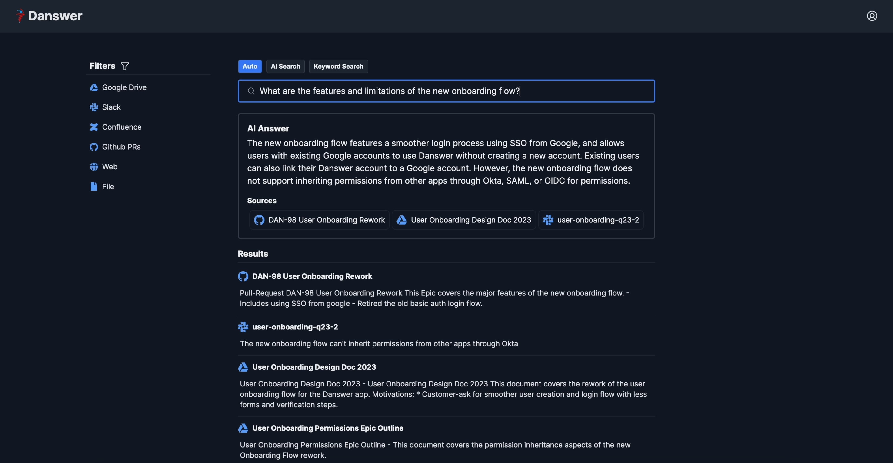
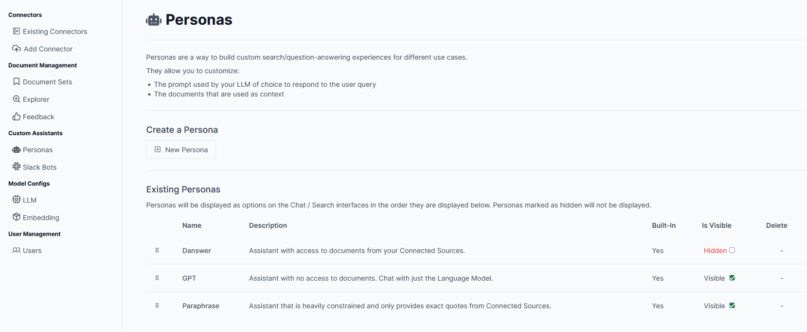

# Ask

Notes on setting up the MIT-licensed [Danswer](https://docs.danswer.dev/introduction). From the [GitHub](https://github.com/danswer-ai/danswer) page, **[Danswer](https://www.danswer.ai/)** lets you ask questions in natural language and get back answers based on your team specific documents. Think ChatGPT if it had access to your team's unique knowledge. Connects to all common workplace tools such as Slack, Google Drive, Confluence, etc.

It also serves as a basic chatbot as well (without using any docs). A lot of the below comes straight from their website. I copied the important bits below, just in case it gets tweaked in the future and links change.



## Setup

[Quickstart](https://docs.danswer.dev/quickstart) was pretty good; here are some addition notes.

1. Clone the [Danswer](https://github.com/danswer-ai/danswer) repo:

```bash
git clone https://github.com/danswer-ai/danswer.git
```

2. Navigate to **danswer/deployment/docker_compose**

```bash
cd danswer/deployment/docker_compose
```

3. Bring up your docker engine and run:
    
To **pull** images from DockerHub and run Danswer:    

```bash
docker compose -f docker-compose.dev.yml -p danswer-stack up -d --pull always --force-recreate
```

Alternatively, to **build** the containers from source and start Danswer, run:

```bash
docker compose -f docker-compose.dev.yml -p danswer-stack up -d --build --force-recreate
```

## Details

Defaults to OpenAI, but you need to enter a key. Can tweak to other [endpoints as required](https://docs.danswer.dev/gen_ai_configs/overview). For embeddings, those are done within the Docker container via [intfloat/e5-base-v2](https://huggingface.co/intfloat/e5-base-v2). Some of the connectors create links to the sources, but others like PDFs required custom [metadata be added](https://docs.danswer.dev/connectors/file#adding-metadata).

## File Uploads

The File Connector indexes user uploaded files. - Currently supports `.txt`, `.pdf`, `.md` and `.mdx` files - Can also upload a `.zip` containing these files - If there are other file types in the zip, the other file types are ignored - Optional metadata line that supports links, document owners, and time updated as metadata.

## Metadata

Can add within the file:

- `#DANSWER_METADATA={"link": "<LINK>"}`
- `<!-- DANSWER_METADATA={"link": "<LINK>"} -->`

Where DANSWER_METADATA= is followed by a json. The valid json keys are:

- link
- primary_owners
- secondary_owners
- doc_updated_at
- file_display_name

For example

`#DANSWER_METADATA={"link": "https://github.com/danswer-ai/danswer/blob/main/CONTRIBUTING.md", "primary_owners": ["yuhong@danswer.ai", "chris@danswer.ai"], "secondary_owners": ["founders@danswer.ai"], "doc_updated_at": "2023-11-30T13:06:08.589616-08:00", "file_display_name": "Desired File Name!", "tag_of_your_choice": "tag_value"}`

Or as a separate file as shown below:

```
| file1.txt
| file2.txt
| .danswer_metadata.json
```

```json
[
    {
        "filename": "file1.txt", 
        "link": "<LINK_TO_FILE1>", 
        "file_display_name": "<WHAT_YOU_WANT_THE_NAME_OF_FILE1_TO_BE_IN_THE_UI>"},
        "primary_owners": ["<FILE1_OWNER>"],
        // this is an arbitrary tag, can be any key/value pair and can be used in the UI as 
        // a filter if you want to constrain your search / conversation to only documents with
        // this tag attached
        "status": "<SOME_STATUS>"
    },
    {
        "filename": "file2.txt", 
        "link": "<LINK_TO_FILE2>", 
        "file_display_name": "<WHAT_YOU_WANT_THE_NAME_OF_FILE2_TO_BE_IN_THE_UI>"},
        "primary_owners": ["<FILE2_OWNER>"],
        // this is an arbitrary tag, can be any key/value pair and can be used in the UI as 
        // a filter if you want to constrain your search / conversation to only documents with
        // this tag attached
        "status": "<SOME_OTHER_STATUS>"
    }
]

```

## Local LLM

I started with `env.prod.template` as the template, copied it, and renamed it to use `.env`. Keep it in the same directory as the compose files. Here are the tweaks I made to get it to work on a local server for the LLM, like [LM Studio](https://lmstudio.ai/). It's **important to note** I needed to use `http://host.docker.internal:8000/v1` so docker could talk to the host.

```
...
GEN_AI_LLM_PROVIDER_TYPE=openai  # Since it's an OpenAI compatible API
GEN_AI_MODEL_VERSION=llama2 # Don't think this matters
GEN_AI_API_KEY=nokeyneeded # Not needed for LM Studio
GEN_AI_API_ENDPOINT=http://host.docker.internal:8000/v1
...
```

I'm still playing with [other recommendations](https://docs.danswer.dev/gen_ai_configs/ollama#set-danswer-to-use-ollama) for local models. So far `DISABLE_LLM_CHOOSE_SEARCH=True` seems like one of the more important ones if you want it to adhere to the docs only.

```
...
# Let's also make some changes to accommodate the weaker locally hosted LLM
QA_TIMEOUT=120  # Set a longer timeout, running models on CPU can be slow
# Always run search, never skip
DISABLE_LLM_CHOOSE_SEARCH=True
# Don't use LLM for reranking, the prompts aren't properly tuned for these models
DISABLE_LLM_CHUNK_FILTER=True
# Don't try to rephrase the user query, the prompts aren't properly tuned for these models
DISABLE_LLM_QUERY_REPHRASE=True
# Don't use LLM to automatically discover time/source filters
DISABLE_LLM_FILTER_EXTRACTION=True
# Uncomment this one if you find that the model is struggling (slow or distracted by too many docs)
# Use only 1 section from the documents and do not require quotes
# QA_PROMPT_OVERRIDE=weak
...
```

## Branding

Still a WIP, but here's what I found in terms of tweaking the interface. **Note** you'll have to build it as mentioned above.

- `Danswer\web\src\app\favicon.ico`, fav icon
- `Danswer\web\src\app\layout.tsx`, site title and description
- `Danswer\web\src\components\Header.tsx`, header name
- `Danswer\web\public\logo.png`, logo used throughout app
- `Danswer\web\src\app\chat\ChatIntro.tsx`, chat section of app

For the rest it's probably easier to hide then recreate the *Danswer* persona in the admin panel. You can see the default `system` and `task` prompt for Danswer persona in `Danswer\backend\danswer\chat\prompts.yaml`, under `id: 0`.

