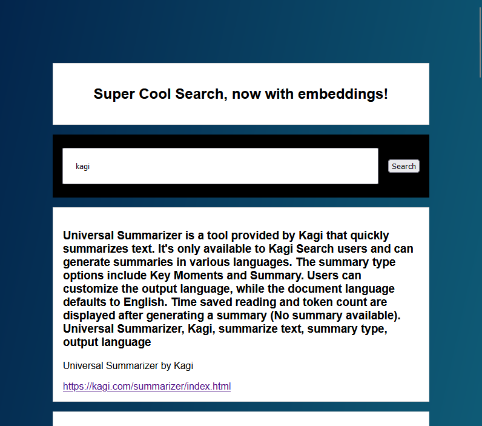

# Vector Search

There's an obvious need for production-level packages, but sometimes all you need is something simple. The developer of the search engine [Kagi](https://kagi.com/) created their own [VectorDB](https://vectordb.com/) python package. It's a very easy (for me at least) package to understand and play with. After `pip install vectordb2`, the examples on that page are great. I'm adding them below in case something changes.

```python
from vectordb import Memory

memory = Memory()

# text = "..."
# metadata = {...}

# Save text with metadata
# This will automatically embed content
memory.save(text, metadata)

# Search for top n relevant chunks
# We will automatically use the fastest vector search backend
results = memory.search(query, top_n=3)
```

and a more advanced one (again, from the above page, but with text removed)

```python
from vectordb import Memory

memory = Memory(chunking_strategy={'mode':'sliding_window', 'window_size': 128, 'overlap': 16})

text = """
Machine learning is a method of data analysis that automates analytical model building.
Machine learning is a powerful tool that can be used to solve a wide variety of problems. As the amount of data available continues to grow, machine learning is likely to become even more important in the future.

"""

metadata = {"title": "Introduction to Machine Learning", "url": "https://example.com/introduction-to-machine-learning"}

memory.save(text, metadata)

text2 = """
Artificial intelligence (AI) is the simulation of human intelligence in machines
that are programmed to think like humans and mimic their actions.
It is important to weigh the potential benefits and risks of AI carefully as we continue to develop this technology. With careful planning and oversight, AI has the potential to make the world a better place. However, if we are not careful, it could also lead to serious problems.
"""

metadata2 = {"title": "Introduction to Artificial Intelligence", "url": "https://example.com/introduction-to-artificial-intelligence"}

memory.save(text2, metadata2)

query = "What is the relationship between AI and machine learning?"

results = memory.search(query, top_n=3)

print(results)
```

## Function

Here's a function equivalent of the above, with the intent to enable bulk loading from other data sources.

```python
from vectordb import Memory

def init_store(items):
    memory = Memory(chunking_strategy={'mode': 'sliding_window', 'window_size': 128, 'overlap': 16})
    
    for item in items:
        text, metadata = item
        memory.save(text, metadata)
        
    return memory

def search_store(memory, query):
    results = memory.search(query, top_n=3)
    return results

items = [
    ("Machine learning is a method of data analysis that automates analytical model building.", 
     {"title": "Introduction to Machine Learning", "url": "https://example.com/introduction-to-machine-learning"}),
    ("Artificial intelligence (AI) is the simulation of human intelligence in machines that are programmed to think like humans and mimic their actions.", 
     {"title": "Introduction to Artificial Intelligence", "url": "https://example.com/introduction-to-artificial-intelligence"})
]

memory = init_store(items)

query = "What is the relationship between AI and machine learning?"
# query = "What is the purpose of machine learning?"

results = search_store(memory, query)

chunk = results[0]['chunk']
title = results[0]['metadata']['title']
url = results[0]['metadata']['url']

print(f"Chunk: {chunk}\nTitle: {title}\nURL: {url}")
```

## CSV

Here's an extended example with a CSV as the source for items. Each column after `text` will be added to the metadata object. Note I added a file to store the results, which is a Python pickle.

```python
from vectordb import Memory
from pathlib import Path
import csv
import os

os.chdir(Path(__file__).parent)


def init_store(csv_file):
    memory = Memory(memory_file='memory.pickle',chunking_strategy={
        'mode':
        'sliding_window',
        'window_size': 128,
        'overlap': 16})

    with open(csv_file, newline='') as csvfile:
        reader = csv.reader(csvfile)
        headers = next(reader)   # First row is the header row
        for row in reader:
            text = row[0]
            metadata = {header: value for header,
                        value in zip(headers[1:], row[1:])}
            memory.save(text, metadata)

    return memory


def search_store(memory, query):
    results = memory.search(query, top_n=3)
    return results


memory = init_store("example.csv")

query = "What is the relationship between AI and machine learning?"
# query = "What is the purpose of machine learning?"

results = search_store(memory, query)

chunk = results[0]['chunk']
title = results[0]['metadata']['title']
url = results[0]['metadata']['url']

print(f"Chunk: {chunk}\nTitle: {title}\nURL: {url}")

```

The csv should look like this:

| text                                                                                                                                               | title                                   | url                                                         |
|----------------------------------------------------------------------------------------------------------------------------------------------------|-----------------------------------------|-------------------------------------------------------------|
| Machine learning is a method of data analysis that automates analytical model building.                                                            | Introduction to Machine Learning        | https://example.com/introduction-to-machine-learning        |
| Artificial intelligence (AI) is the simulation of human intelligence in machines that are programmed to think like humans and mimic their actions. | Introduction to Artificial Intelligence | https://example.com/introduction-to-artificial-intelligence |

## Web App



Assuming you created a stored memory file `memory.pickle` (see above), a quick and easy way to search it is to create a web app. Flask is popular, and with `pip install flask` you're off to the races. Call this first file `app.py`, and after creating the others start is with `python app.py`.

```python
from flask import Flask, request, render_template
from vectordb import Memory
import os
from pathlib import Path

os.chdir(Path(__file__).parent)

app = Flask(__name__)
memory=Memory(memory_file='memory.pickle')

@app.route('/', methods=['GET', 'POST'])
def search():
    results = None
    if request.method == 'POST':
        query = request.form.get('query')
        results = memory.search(query, top_n=10, unique=True, batch_results="flatten")
    return render_template('index.html', results=results)

if __name__ == "__main__":
    app.run(debug=True)
```

Here's the HTML page to get going, which you'll name `index.html`.

```html
<!-- Put this file in templates/index.html -->
<!DOCTYPE html>
<html>
    <head>
        <title>Super Cool Search</title>
        <link rel="stylesheet" type="text/css" href="{{ url_for('static', filename='styles.css') }}">
    </head>
    <body>
        <div id="header"><h2 style="text-align: center;">Super Cool Search, now with embeddings!</h2></div>
        <form method="POST" class="search-box">
            <input type="text" name="query" required>
            <button type="submit">Search</button>
        </form>
        
            
                <div class="card">
                    <h3>{{result['chunk']}}</h3>
                    <p>{{result['metadata']['title']}}</p>
                    <a href="{{result['metadata']['url']}}" target="_blank" rel="noopener noreferrer">{{result['metadata']['url']}}</a>
                </div>
            
        
            <h2>No results found.</h2>
        
    </body>
</html>
```

and the css

```css
/* Put this file in static/styles.css */
body {
    background: linear-gradient(to bottom right, #03254c, #167F92);
    padding: 10%;
}

#header {
    border: 1px solid #ddd;
    background-color: #fff;
    padding: 1rem;
    margin: 1rem 0;
}

form.search-box {
    display: flex;
    justify-content: center;
    align-items: center;
    height: 10vh;
    background-color: #000;
    padding: 1rem;
}

form.search-box input[type="text"] {
    flex: 1;
    margin-right: 1rem;
    max-width: 90%;
    padding: 20px;
}

div.card {
    border: 1px solid #ddd;
    background-color: #fff;
    padding: 1rem;
    margin: 1rem 0;
    z-index: 1;
    position: relative;
}
```

## Pickle

Want to see the contents you saved? Here are a few options...

`import pickle; pickle.load(open('memory.pickle', 'rb'))`

or a bit prettier...

```
import pickle
import pprint

loaded_data = pickle.load(open('memory.pickle', 'rb'))
pprint.pprint(loaded_data)
```

or have it more JSON-y with:

```
import json
import pickle

loaded_data = pickle.load(open('memory.pickle', 'rb'))
json_data = json.dumps(loaded_data, indent=4)  # Set indent=4 for improved readability
print(json_data)
```