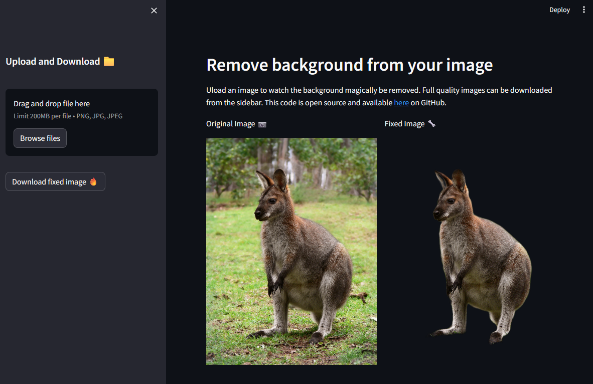

# Remove Background

Deployed this [app](https://github.com/tyler-simons/BackgroundRemoval). Made a few tweaks of the icons and UI (including [this](https://gist.github.com/Sven-Bo/1ad6efa04afc2e957717e5a5fc4320b8)) but that's about it. Note the primary magic [rembg](https://github.com/danielgatis/rembg) has a lot of additional options and features.

## Setup

1. Navigate to folder where you want to place files.
2. Clone repo with `git clone https://github.com/tyler-simons/BackgroundRemoval.git`
3. `cd BackgroundRemoval`
4. Create a virtual environment with `python -m venv venv`
5. Activate with `.\venv\Scripts\Activate.ps1`
6. Install requirements with `pip install -r requirements.txt`
7. Create a folder in the project `.\streamlit\config.toml`
8. Run the app with `streamlit run bg_remove.py`

Modify the `config.toml` to have the below.

```toml
[browser]
gatherUsageStats = false

[server]
port = 80
```

Supported icons and their names are [here](https://streamlit-emoji-shortcodes-streamlit-app-gwckff.streamlit.app/). Basically just changed a few of them.

```python
from io import BytesIO

import streamlit as st
from PIL import Image
from rembg import remove

hide_st_style = """
            <style>
            MainMenu {visibility: hidden;}
            footer {visibility: hidden;}
            header {visibility: hidden;}
            </style>
            """

st.set_page_config(layout="wide", page_title="Image Background Remover")

st.write("## Remove background from your image")
st.write(
    "Upload an image to watch the background magically be removed. Full quality images can be downloaded from the sidebar. This code is open source and available [here](<https://github.com/tyler-simons/BackgroundRemoval>) on GitHub."
)
st.sidebar.write("## :arrow_up: Upload and Download :arrow_down:")

# Create the columns
col1, col2 = st.columns(2)

# Download the fixed image
def convert_image(img):
    buf = BytesIO()
    img.save(buf, format="PNG")
    byte_im = buf.getvalue()
    return byte_im

# Package the transform into a function
def fix_image(upload):
    image = Image.open(upload)
    col1.write("Original Image :camera:")
    col1.image(image)

    fixed = remove(image)
    col2.write("Fixed Image :wrench:")
    col2.image(fixed)
    st.sidebar.markdown(hide_st_style, unsafe_allow_html=True)
    st.sidebar.download_button(
        ":sparkles: :sparkles: Download fixed image :sparkles: :sparkles:", convert_image(fixed), "fixed.png", "image/png"
    )

# Create the file uploader
my_upload = st.sidebar.file_uploader("Upload file here", label_visibility="hidden", type=["png", "jpg", "jpeg"])

# Fix the image!
if my_upload is not None:
    fix_image(upload=my_upload)
else:
    fix_image("./wallaby.jpg")
```

