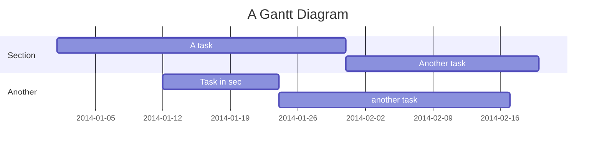
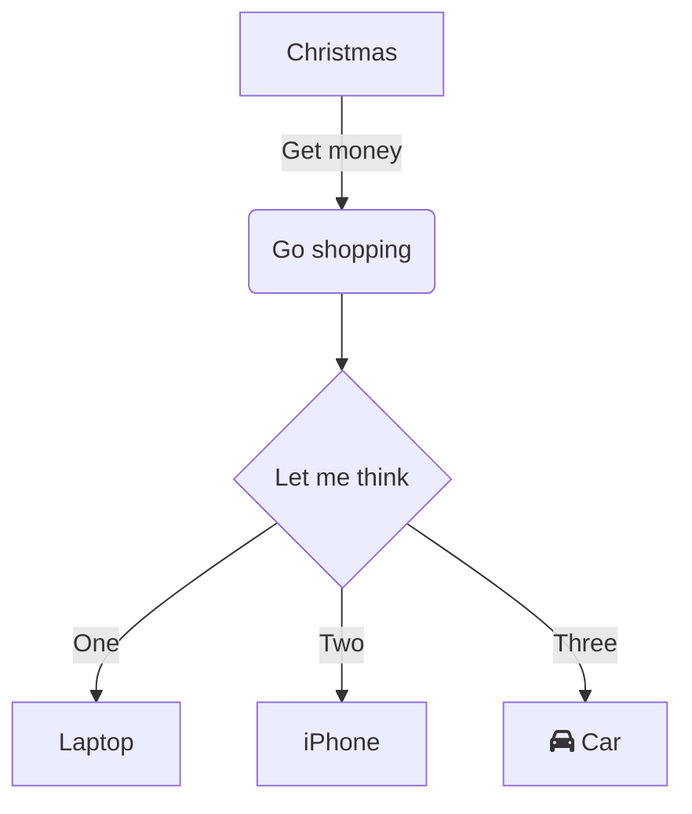
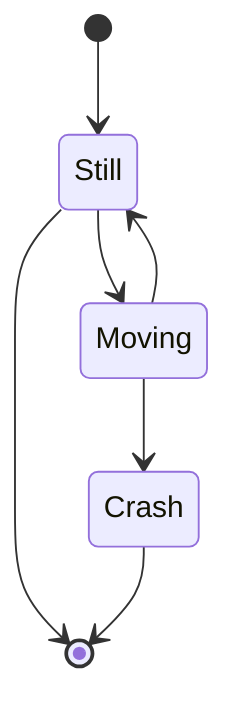

# Cheat Sheet

Here's how to make **bold text** and _italicized text_

> blockquote text is here.

You can embed video with an HTML tag like so (but it should **NOT** be in the code block). The below HTML needs an extra `../` as shown.

```html
<video width="100%" controls>
  <source src="../../_assets/VideoName.mp4" type="video/mp4">
</video>
```

*This text will be italic*
_This will also be italic_

**This text will be bold**
__This will also be bold__

~~this will be strikethrough'd~~

==this will be highlighted==

[Mermaid](https://mermaid-js.github.io/mermaid-live-editor) for diagrams (disabled for now on this site, but easy to re-enable in `mkdocs.yml`). [Example Diagrams](Example%20Diagrams.md) will be broken too.







___

Here's a simple footnote,[^1] and here's a longer one.[^bignote]

[^1]: meaningful!

[^bignote]: Here's one with multiple paragraphs and code.

    Indent paragraphs to include them in the footnote.

    `{ my code }`

    Add as many paragraphs as you like.

You can also use inline footnotes. ^[notice that the carat goes outside of the brackets on this one.]

> [!info]
> You can use + to have it default open.
> More valid types are note, abstract, summary, tldr, info, todo, tip, hint, important, success, check, done, question, help, faq, warning, caution, attention, failure, fail, missing, danger, error, bug, example, quote, cite


Resized inline image:


Numbered Lists

1. First item
2. Second item
3. Third item

Dashed Lists

- First item
- Second item
- Third item

Checkboxes

- [x] Write the press release
- [ ] Update the website
- [ ] Contact the media

`code sample here, code block below`

```json
{
  "firstName": "John",
  "lastName": "Smith",
  "age": 25
}
```

Link [Google](https://www.google.com)

Network link [Server Link](file:///\\\server\folder)

| Syntax    | Description |
| --------- | ----------- |
| Header    | Title       |
| Paragraph | Text        |

More Formatting:
[Format your notes - Obsidian Help](https://help.obsidian.md/How+to/Format+your+notes)

Valid languages in Codeblocks (that I may care about):
[Prism (prismjs.com)](https://prismjs.com/#supported-languages)

-   Markup - `markup`, `html`, `xml`, `svg`, `mathml`, `ssml`, `atom`, `rss`
-   CSS - `css`
-   C-like - `clike`
-   JavaScript - `javascript`, `js`
-   ABAP - `abap`
-   ABNF - `abnf`
-   ActionScript - `actionscript`
-   Ada - `ada`
-   Agda - `agda`
-   AL - `al`
-   ANTLR4 - `antlr4`, `g4`
-   Apache Configuration - `apacheconf`
-   Apex - `apex`
-   APL - `apl`
-   AppleScript - `applescript`
-   AQL - `aql`
-   Arduino - `arduino`, `ino`
-   ARFF - `arff`
-   ARM Assembly - `armasm`, `arm-asm`
-   Arturo - `arturo`, `art`
-   AsciiDoc - `asciidoc`, `adoc`
-   ASP.NET (C#) - `aspnet`
-   6502 Assembly - `asm6502`
-   Atmel AVR Assembly - `asmatmel`
-   AutoHotkey - `autohotkey`
-   AutoIt - `autoit`
-   AviSynth - `avisynth`, `avs`
-   Avro IDL - `avro-idl`, `avdl`
-   AWK - `awk`, `gawk`
-   Bash - `bash`, `shell`
-   BASIC - `basic`
-   Batch - `batch`
-   BBcode - `bbcode`, `shortcode`
-   Bicep - `bicep`
-   Birb - `birb`
-   Bison - `bison`
-   BNF - `bnf`, `rbnf`
-   Brainfuck - `brainfuck`
-   BrightScript - `brightscript`
-   Bro - `bro`
-   BSL (1C:Enterprise) - `bsl`, `oscript`
-   C - `c`
-   C# - `csharp`, `cs`, `dotnet`
-   C++ - `cpp`
-   CFScript - `cfscript`, `cfc`
-   ChaiScript - `chaiscript`
-   CIL - `cil`
-   Clojure - `clojure`
-   CMake - `cmake`
-   COBOL - `cobol`
-   CoffeeScript - `coffeescript`, `coffee`
-   Concurnas - `concurnas`, `conc`
-   Content-Security-Policy - `csp`
-   Cooklang - `cooklang`
-   Coq - `coq`
-   Crystal - `crystal`
-   CSS Extras - `css-extras`
-   CSV - `csv`
-   CUE - `cue`
-   Cypher - `cypher`
-   D - `d`
-   Dart - `dart`
-   DataWeave - `dataweave`
-   DAX - `dax`
-   Dhall - `dhall`
-   Diff - `diff`
-   Django/Jinja2 - `django`, `jinja2`
-   DNS zone file - `dns-zone-file`, `dns-zone`
-   Docker - `docker`, `dockerfile`
-   DOT (Graphviz) - `dot`, `gv`
-   EBNF - `ebnf`
-   EditorConfig - `editorconfig`
-   Eiffel - `eiffel`
-   EJS - `ejs`, `eta`
-   Elixir - `elixir`
-   Elm - `elm`
-   Embedded Lua templating - `etlua`
-   ERB - `erb`
-   Erlang - `erlang`
-   Excel Formula - `excel-formula`, `xlsx`, `xls`
-   F# - `fsharp`
-   Factor - `factor`
-   False - `false`
-   Firestore security rules - `firestore-security-rules`
-   Flow - `flow`
-   Fortran - `fortran`
-   FreeMarker Template Language - `ftl`
-   GameMaker Language - `gml`, `gamemakerlanguage`
-   GAP (CAS) - `gap`
-   G-code - `gcode`
-   GDScript - `gdscript`
-   GEDCOM - `gedcom`
-   gettext - `gettext`, `po`
-   Gherkin - `gherkin`
-   Git - `git`
-   GLSL - `glsl`
-   GN - `gn`, `gni`
-   GNU Linker Script - `linker-script`, `ld`
-   Go - `go`
-   Go module - `go-module`, `go-mod`
-   Gradle - `gradle`
-   GraphQL - `graphql`
-   Groovy - `groovy`
-   Haml - `haml`
-   Handlebars - `handlebars`, `hbs`, `mustache`
-   Haskell - `haskell`, `hs`
-   Haxe - `haxe`
-   HCL - `hcl`
-   HLSL - `hlsl`
-   Hoon - `hoon`
-   HTTP - `http`
-   HTTP Public-Key-Pins - `hpkp`
-   HTTP Strict-Transport-Security - `hsts`
-   IchigoJam - `ichigojam`
-   Icon - `icon`
-   ICU Message Format - `icu-message-format`
-   Idris - `idris`, `idr`
-   .ignore - `ignore`, `gitignore`, `hgignore`, `npmignore`
-   Inform 7 - `inform7`
-   Ini - `ini`
-   Io - `io`
-   J - `j`
-   Java - `java`
-   JavaDoc - `javadoc`
-   JavaDoc-like - `javadoclike`
-   Java stack trace - `javastacktrace`
-   Jexl - `jexl`
-   Jolie - `jolie`
-   JQ - `jq`
-   JSDoc - `jsdoc`
-   JS Extras - `js-extras`
-   JSON - `json`, `webmanifest`
-   JSON5 - `json5`
-   JSONP - `jsonp`
-   JS stack trace - `jsstacktrace`
-   JS Templates - `js-templates`
-   Julia - `julia`
-   Keepalived Configure - `keepalived`
-   Keyman - `keyman`
-   Kotlin - `kotlin`, `kt`, `kts`
-   KuMir (КуМир) - `kumir`, `kum`
-   Kusto - `kusto`
-   LaTeX - `latex`, `tex`, `context`
-   Latte - `latte`
-   Less - `less`
-   LilyPond - `lilypond`, `ly`
-   Liquid - `liquid`
-   Lisp - `lisp`, `emacs`, `elisp`, `emacs-lisp`
-   LiveScript - `livescript`
-   LLVM IR - `llvm`
-   Log file - `log`
-   LOLCODE - `lolcode`
-   Lua - `lua`
-   Magma (CAS) - `magma`
-   Makefile - `makefile`
-   Markdown - `markdown`, `md`
-   Markup templating - `markup-templating`
-   Mata - `mata`
-   MATLAB - `matlab`
-   MAXScript - `maxscript`
-   MEL - `mel`
-   Mermaid - `mermaid`
-   Mizar - `mizar`
-   MongoDB - `mongodb`
-   Monkey - `monkey`
-   MoonScript - `moonscript`, `moon`
-   N1QL - `n1ql`
-   N4JS - `n4js`, `n4jsd`
-   Nand To Tetris HDL - `nand2tetris-hdl`
-   Naninovel Script - `naniscript`, `nani`
-   NASM - `nasm`
-   NEON - `neon`
-   Nevod - `nevod`
-   nginx - `nginx`
-   Nim - `nim`
-   Nix - `nix`
-   NSIS - `nsis`
-   Objective-C - `objectivec`, `objc`
-   OCaml - `ocaml`
-   Odin - `odin`
-   OpenCL - `opencl`
-   OpenQasm - `openqasm`, `qasm`
-   Oz - `oz`
-   PARI/GP - `parigp`
-   Parser - `parser`
-   Pascal - `pascal`, `objectpascal`
-   Pascaligo - `pascaligo`
-   PATROL Scripting Language - `psl`
-   PC-Axis - `pcaxis`, `px`
-   PeopleCode - `peoplecode`, `pcode`
-   Perl - `perl`
-   PHP - `php`
-   PHPDoc - `phpdoc`
-   PHP Extras - `php-extras`
-   PlantUML - `plant-uml`, `plantuml`
-   PL/SQL - `plsql`
-   PowerQuery - `powerquery`, `pq`, `mscript`
-   PowerShell - `powershell`
-   Processing - `processing`
-   Prolog - `prolog`
-   PromQL - `promql`
-   .properties - `properties`
-   Protocol Buffers - `protobuf`
-   Pug - `pug`
-   Puppet - `puppet`
-   Pure - `pure`
-   PureBasic - `purebasic`, `pbfasm`
-   PureScript - `purescript`, `purs`
-   Python - `python`, `py`
-   Q# - `qsharp`, `qs`
-   Q (kdb+ database) - `q`
-   QML - `qml`
-   Qore - `qore`
-   R - `r`
-   Racket - `racket`, `rkt`
-   Razor C# - `cshtml`, `razor`
-   React JSX - `jsx`
-   React TSX - `tsx`
-   Reason - `reason`
-   Regex - `regex`
-   Rego - `rego`
-   Ren'py - `renpy`, `rpy`
-   ReScript - `rescript`, `res`
-   reST (reStructuredText) - `rest`
-   Rip - `rip`
-   Roboconf - `roboconf`
-   Robot Framework - `robotframework`, `robot`
-   Ruby - `ruby`, `rb`
-   Rust - `rust`
-   SAS - `sas`
-   Sass (Sass) - `sass`
-   Sass (Scss) - `scss`
-   Scala - `scala`
-   Scheme - `scheme`
-   Shell session - `shell-session`, `sh-session`, `shellsession`
-   Smali - `smali`
-   Smalltalk - `smalltalk`
-   Smarty - `smarty`
-   SML - `sml`, `smlnj`
-   Solidity (Ethereum) - `solidity`, `sol`
-   Solution file - `solution-file`, `sln`
-   Soy (Closure Template) - `soy`
-   SPARQL - `sparql`, `rq`
-   Splunk SPL - `splunk-spl`
-   SQF: Status Quo Function (Arma 3) - `sqf`
-   SQL - `sql`
-   Squirrel - `squirrel`
-   Stan - `stan`
-   Stata Ado - `stata`
-   Structured Text (IEC 61131-3) - `iecst`
-   Stylus - `stylus`
-   SuperCollider - `supercollider`, `sclang`
-   Swift - `swift`
-   Systemd configuration file - `systemd`
-   T4 templating - `t4-templating`
-   T4 Text Templates (C#) - `t4-cs`, `t4`
-   T4 Text Templates (VB) - `t4-vb`
-   TAP - `tap`
-   Tcl - `tcl`
-   Template Toolkit 2 - `tt2`
-   Textile - `textile`
-   TOML - `toml`
-   Tremor - `tremor`, `trickle`, `troy`
-   Turtle - `turtle`, `trig`
-   Twig - `twig`
-   TypeScript - `typescript`, `ts`
-   TypoScript - `typoscript`, `tsconfig`
-   UnrealScript - `unrealscript`, `uscript`, `uc`
-   UO Razor Script - `uorazor`
-   URI - `uri`, `url`
-   V - `v`
-   Vala - `vala`
-   VB.Net - `vbnet`
-   Velocity - `velocity`
-   Verilog - `verilog`
-   VHDL - `vhdl`
-   vim - `vim`
-   Visual Basic - `visual-basic`, `vb`, `vba`
-   WarpScript - `warpscript`
-   WebAssembly - `wasm`
-   Web IDL - `web-idl`, `webidl`
-   WGSL - `wgsl`
-   Wiki markup - `wiki`
-   Wolfram language - `wolfram`, `mathematica`, `nb`, `wl`
-   Wren - `wren`
-   Xeora - `xeora`, `xeoracube`
-   XML doc (.net) - `xml-doc`
-   Xojo (REALbasic) - `xojo`
-   XQuery - `xquery`
-   YAML - `yaml`, `yml`
-   YANG - `yang`
-   Zig - `zig`
