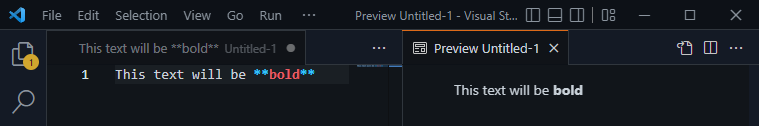

# Getting Started

The below has been taken from [here](https://www.markdownguide.org/getting-started/), which is an excellent guide and has more details worth reading. There's also a [60-second guide](https://commonmark.org/help/) for formatting.

> [!example]
> Want to **skip all the below** and dive right in? Check out this [free web editor](https://stackedit.io/app) (nothing to install) that instantly renders what you do!

## What is Markdown?

Markdown is a lightweight markup language that you can use to add formatting elements to plaintext text documents. Simplifying it more, Markdown is a text file that uses certain characters in certain ways to create a "pretty" document.

Using Markdown is different than using a [WYSIWYG](https://en.wikipedia.org/wiki/WYSIWYG) editor. In an application like Microsoft Word, you click buttons to format words and phrases, and the changes are visible immediately. Markdown isn’t like that. When you create a Markdown-formatted file, you add Markdown syntax to the text to indicate which words and phrases should look different.

For example, to denote a heading (H1), you add a number sign before it with a space (e.g., `# Heading One`). Or to make a word bold, you add two asterisks before and after it (e.g., `this text will be **bold**`). It may take a while to get used to seeing Markdown syntax in your text, especially if you’re accustomed to WYSIWYG applications.

You can add Markdown formatting elements to a plaintext file using a text editor application. Or you can use one of the many Markdown applications for macOS, Windows, Linux, iOS, and Android operating systems. There are also several web-based applications specifically designed for writing in Markdown.

Depending on the application you use, you may not be able to preview the formatted document in real time. But that’s okay. [According to Gruber](https://daringfireball.net/projects/markdown/), Markdown syntax is designed to be readable and unobtrusive, so the text in Markdown files can be read even if it isn’t rendered.

> The overriding design goal for Markdown’s formatting syntax is to make it as readable as possible. The idea is that a Markdown-formatted document should be publishable as-is, as plain text, without looking like it’s been marked up with tags or formatting instructions.

## Why Use Markdown?

You might be wondering why people use Markdown instead of a WYSIWYG editor. Why write with Markdown when you can press buttons in an interface to format your text? As it turns out, there are several reasons why people use Markdown instead of WYSIWYG editors.

-   Markdown can be used for everything. People use it to create [websites](https://www.markdownguide.org/getting-started/#websites), [documents](https://www.markdownguide.org/getting-started/#documents), [notes](https://www.markdownguide.org/getting-started/#notes), [books](https://www.markdownguide.org/getting-started/#books), [presentations](https://www.markdownguide.org/getting-started/#presentations), [email messages](https://www.markdownguide.org/getting-started/#email), and [technical documentation](https://www.markdownguide.org/getting-started/#documentation).
    
-   Markdown is portable. Files containing Markdown-formatted text can be opened using virtually any application. If you decide you don’t like the Markdown application you’re currently using, you can import your Markdown files into another Markdown application. That’s in stark contrast to word processing applications like Microsoft Word that lock your content into a proprietary file format.
    
-   Markdown is platform independent. You can create Markdown-formatted text on any device running any operating system.
    
-   Markdown is future proof. Even if the application you’re using stops working at some point in the future, you’ll still be able to read your Markdown-formatted text using a text editing application. This is an important consideration when it comes to books, university theses, and other milestone documents that need to be preserved indefinitely.
    
-   Markdown is everywhere. Websites like [Reddit](https://www.markdownguide.org/tools/reddit/) and GitHub support Markdown, and lots of desktop and web-based applications support it.

## Notes

In nearly every way, Markdown is the ideal syntax for taking notes. Sadly, [Evernote](https://evernote.com/) and [OneNote](https://www.onenote.com/), two of the most popular note applications, don’t currently support Markdown. The good news is that several other note applications _do_ support Markdown:

-   [Obsidian](https://www.markdownguide.org/tools/obsidian/) is a popular Markdown note-taking application loaded with features.
-   [Simplenote](https://www.markdownguide.org/tools/simplenote/) is a free, barebones note-taking application available for every platform.
-   [Notable](https://www.markdownguide.org/tools/notable/) is a note-taking application that runs on a variety of platforms.
-   [Bear](https://www.markdownguide.org/tools/bear/) is an Evernote-like application available for Mac and iOS devices. It doesn’t exclusively use Markdown by default, but you can enable Markdown compatibility mode.
-   [Joplin](https://www.markdownguide.org/tools/joplin/) is a note taking application that respects your privacy. It’s available for every platform.
-   [Boostnote](https://www.markdownguide.org/tools/boostnote/) bills itself as an “open source note-taking app designed for programmers.”

If you can’t part with Evernote, check out [Marxico](https://marxi.co/), a subscription-based Markdown editor for Evernote, or use [Markdown Here](https://www.markdownguide.org/tools/markdown-here/) with the Evernote website.

## Syntax

Learn everything you need to know [here](https://www.markdownguide.org/basic-syntax/). For Obsidian Notes specifics check out [this link](https://help.obsidian.md/How+to/Format+your+notes).

> [!warning]
> While Markdown is an official standard (defined by [CommonMark](https://commonmark.org/)), the implementation of some *non-standard items* vary depending on the application used. A good example is [callout blocks](https://quarto.org/docs/authoring/callouts.html), also known as [admonitions](https://squidfunk.github.io/mkdocs-material/reference/admonitions/) or just [callouts](https://help.obsidian.md/How+to/Format+your+notes#Callouts). Note the use of `:::` in the first link and `!!!` in the next and `> ` in the last. If needed one can use regular expressions to find/replace content. This only comes up if you try to use a markdown file in another application.
