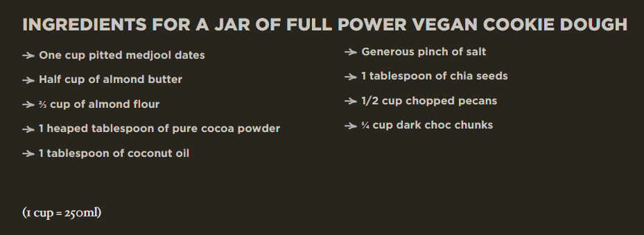

# Recipes

## Vegan Cookie Dough

Recipe from [here](https://bikepacking.com/plan/full-power-vegan-cookie-dough/). Soak the dates in hot water for 10 minutes. Then drain them and keep the date water for later use.  
  
In a food processor, blend dates. Use date water if too dry, or try coconut milk or oat milk for more doughiness. Add almond butter, almond flour, coconut oil, cacao powder, a bit of salt (if almond butter is unsalted), chia seeds, and pulse it all together. You’re after a cookie dough texture.

