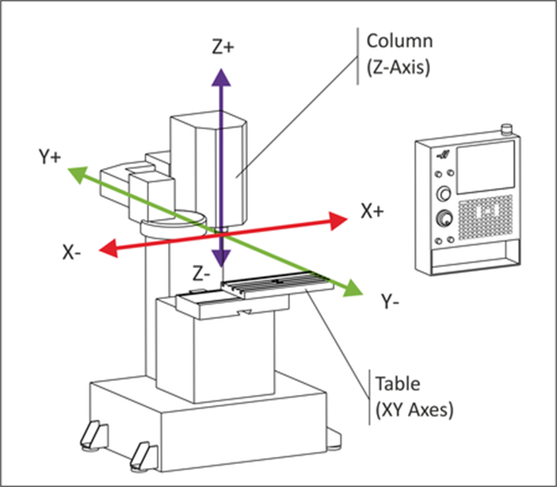
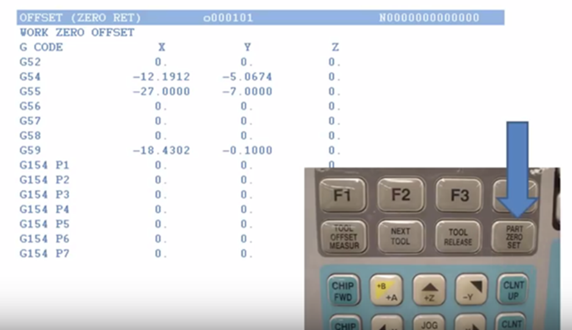
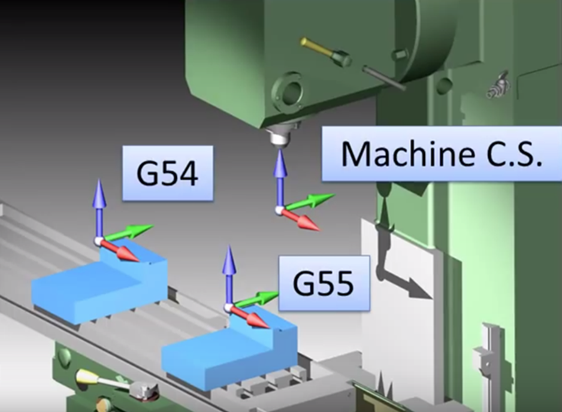
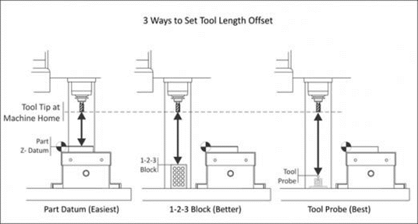
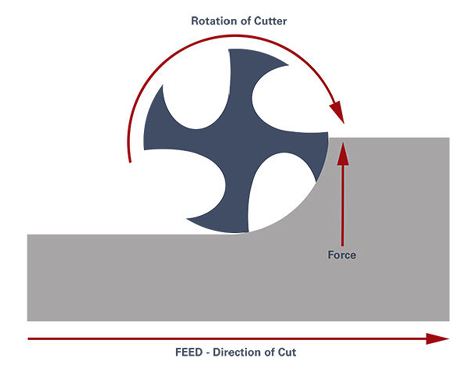
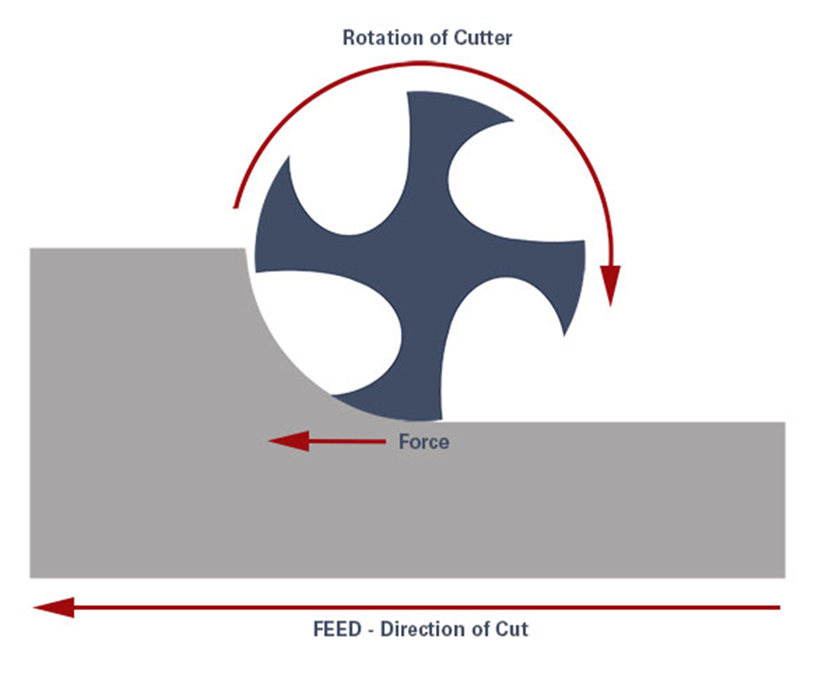

# CNC Overview

## Coordinate System Directions

The movement of your CNC along the coordinate system is always based on how your tool moves, not the table. For example, increasing the X coordinate value would move the table left, but when looked at from the perspective of the tool, it’s moving right along a workpiece.
 

## How CNC and Human Coordinates Interact

 
As we mentioned above, human operators will use a WCS which provides an easy set of coordinates for writing a CNC program. However, these coordinates are always different from a machine’s coordinates, so how does your CNC machine line the two up? With offsets.
 
A CNC machine will use what’s called a work offset to determine the difference in distance between your WCS and its own home position. These offsets get stored in the controller of the machine, and can typically be accessed in an offset table like the one below.

 
Here we can see that several offsets have already been programmed, G54, G55, and G59. What’s the benefit in having multiple offsets? If you are machining multiple parts in one job, each part can be assigned its own offset. This allows the CNC machine to accurately relate its coordinate system to multiple parts in different places, and complete multiple setups at once.

 

## Tool Offsets

 
It’s pretty common to use multiple tools for the same job, but you need a way to account for different tool lengths. A tool offset are programmed into your CNC machine to make this easy work. With a tool offset programmed, your CNC machine will know exactly how far each tool extends from the spindle. There are several ways to record a tool offset:
 
- Jogging. Move the tool from the machine’s home position to the part’s zero position. The distance traveled is measured and entered as the tool’s offset.
- Precision block. Set all tools to a common Z position at the top of a 1-2-3 precision block that rests on the machine’s table.
- Probing. Use a probe to automatically determine the tool offset. This is the most efficient method but also the most expensive, as it requires the probe equipment.

## Climb Milling

- Chip width starts from maximum and decreases so heat generated will more likely transfer to the chip.
- Creates cleaner shear plane which causes the tool to rub less and increases tool life.
- Chips are removed behind the cutter which reduces the chance of re-cutting.
- Downwards forces in horizontal milling are created that help hold the workpiece down; less complex work holdings are needed when coupled with these forces.

 

## Conventional Milling

- Chip width starts from zero and increases which causes more heat to diffuse into the workpiece and produces work hardening.
- Tool rubs more at the beginning of the cut causing faster tool wear and decreases tool life.
- Chips are carried upward by the tooth and fall in front of cutter creating a marred finish and re-cutting of chips.
- Upwards forces created in horizontal milling tend to lift the workpiece, more intricate and expansive work holdings are needed to lessen the lift created.
