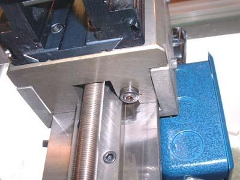
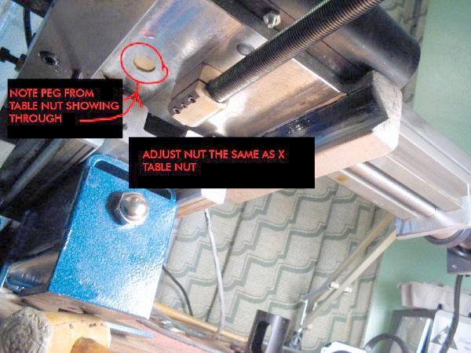

# Taig Micro Mill

Ordered a refurbished version of [this](https://taigtools.com/product/micro-mill-2019cr/).

## Links

[Micro Machine Shop](https://www.micro-machine-shop.com/)  
[Carter Tools](https://www.cartertools.com/)  
[Taig Tools](https://taigtools.com/)  

## Description

*Taken from link above*

The Micro Mill is a very rigid and precise machine that uses some of the most advanced techniques compared to its competitors. The Y-axis and Z-axis are supported on 2 1/2 inch square steel tubing to provide a very solid feel. The leadscrews are all 1/2-20 unlike a lot of machines of similar size that use 1/4 inch leadscrews. TAIG prefers to provide added mechanical features to allow the mill to be more useful without raising the price. Being an aerospace manufacturer for over 18 years our machinists know the importance of table back-lash compensation and full gib adjustments for wear as employed in the manufacture of the Micro Mill. Basically, the Micro Mill was designed by machinists and built by machinists. Overall working accuracy should exceed .0005 in. All machines are sold with a 14 day refund and a full 2 year factory warranty on all Mill components and accessories.

The Micro Mill has effortless, chatterless, table and millhead movement due to the unique design of oversized gibs, ground ‘Y’ axis steel ways, and a massive carriage assembly. The ground steel ways on the vertical mill head support provides a very rigid Z-axis and makes the Micro Mill ready for CNC upgrade if you desire. Our small Mill is really a scaled down version of a big Mill with manual operation.

This is the machine you don’t have to baby. The Micro Mill is a rugged precision instrument that has plenty of rigidity. It has a life-time ball bearing spindle, coupled with a six speed positive vee belt drive. Spindle speeds in geometric progression (CR version 1000 – 10000 rpm) provide the power to “HOG” 1/8 inch cuts in mild steel or the speed and precision to “dust” a few tenths (compare that to other mills of similar size on the market, **you can’t!**).

Other big Mill features include large .001 inch graduations on friction adjustable micrometer dials for the X,Y,& Z axis. Adjustable gibs provide full compensation for X,Y & Z axis wear. The spindle head column can rotate from 0 to 180 degrees to provide for special machining tasks. All this adds up to a BEST VALUE in small Mills.

Should there be any questions regarding specific uses of the Micro Mill please feel free to call, write, email, or visit our facility.

## Specifications

**GENERAL**

Height 26-3/8 in  
Width 22 in  
Depth 21 in  
Weight 80 lbs (manual) 105 lbs (CNC)  
Maximum bearing runout 0.0002 in.  
X axis dovetails 45 deg.  
Y axis dovetails 90 deg.  
Z axis steel box ways  
1/2″-20 lead screws on X,Y,& Z  
All lead screw drives have friction adjustable micrometer dials in .001 inch increments  
Pulley type std. 5/8 in. bore multi-step vee belt.  
Construction – Steel, hard anodized aluminum on all moving components, adjustable brass gibs, and precision ground steel ways hand lapped for long life and accuracy.

**CAPACITY**

Travel in X axis 12 in. (Model 2019)  
Travel in Y axis 5.5 in  
Travel in Z axis 6.0 in  
Table dimensions 3 1/2 x 18.4 inches (Model 2019)  
Maximum Z-distance to table 9.0 in  
Z-Axis swivel 90 degrees  
6 spindle speeds 1000-10000 RPM (CR & CNC)  
Z axis column rotation up to 180 degrees  
Spindle head rotation 90 degrees

**SPINDLE (ER16 SPINDLE)**

Spindle Runout less than .0002  
Maximum spindle speed 10000 RPM  
Sealed precision ball bearing  
Bearing OD 1.5748 in., ID 0.6692 in.  
Spindle nose 22mm X 1.5mm  
Spindle hole 0.406 in.  
Spindle ID taper 8 deg (16 deg included)  
Max. collet diameter 3/8 in.  
Pulley size 5/8 in. bore.  
Ball Bearings in all lead screw bearing blocks

## Setup and Alignment

Documentation from [here](https://www.cartertools.com/). More good resources at that link as well.

### Quick Installation

The table as it comes from the factory. Clean the mating surface in back of the machine clean of all grease, dirt, etc.

The column as it comes from the factory. Clean the mating surface (the round shape at the bottom of the column.

Assemble the column to the table with the wrench. Make it just tight enough to move by hand, but not so loose that it falls to the side (been there, left a nice gouge in my table the first time I did this).

Place the square on the table and adjust the column so the headstock is square to the table.

Tighten it up and you can start using the mill.

If you want more accuracy, use a dial test indicator to "sweep" the table. It is easier if you use blocks rather than running the tip into the table slots. You can drive yourself crazy trying to take out the last .001", so don't! But seriously, if you can get it perpendicular to within .001 over 8" that is pretty good for a milling machine. With practice you can get it under .001", but it takes some finesse.

Tighten the column, reindicate (might have shifted, I told you you could go insane). I find that tightening it as tight as possible with my hand choked up on the wrench so it is near the head is pretty good. Too loose and the column will shift, too tight and it will bend something (40 ft/lbs is too much! I did it and bent the front of the machine)

The right hand table gib adjustment screw.

Tighten the left screw inward while loosening the right screw out to tighten the table, to loosen the table tighten the right in while loosening the left out.

The screw in the middle of the front of the table locks it.

The left hand table gib adjustment screw. (top screw in picture)

The y-axis gib screws, adjust the two screws in or out to adjust the gib. The bottom screw locks the table

The top column gib screw. The top screw will tighten the gib when tightened, while the bottom screw is loosened out. The bottom screw will loosen the gib while tightened, as the top screw is loosened.

The bottom column gib screw.

Sometimes the z-axis dovetail mount is out a tiny bit, which can through compounding of errors make the spindle not perpendicuar to the y-axis. Do not adjust it unless you know what you are doing! In practice I have found sometimes slipping a thin (.001) shim in the dovetail plate will correct this problem.

But again, don't do it unless you really know how to chase down errors! This can really drive you crazy sometimes. Not to mention driving me crazy when I try to fix your problem via email.

This is a drawing I did showing the mechanics of the x axis tapered gib from the top. Some clarifications:

If either of the screws A and B are loose, then the gib can move freely against the tapered surface. This will cause binding when the table travels to the right and looseness when the table travels to the left. The screws push a thick washer that bears against the gib ends and rides in a counterbored hole. When adjusted both screw heads must be tight against the gib ends.

As you can see, if you tighten A and loosen B, then the gib will move right, tightening the gib against the table.

Think of the screws not so much as tightening and loosening the gib, but as positioning the gib against it's angled surface.  
It is the angled surface that actually presses the gib against the x-axis.

### Detailed Installation

The underside of the mill base.

Closeup of the y-axis gib retainer plate. The tall screw locks the gib (never used for CNC). The two side screws adjust the gib and the nuts lock the adjustment.

X axis gib screw.

Underside of the y-axis bearing plate. Notice the small roll pin that locks the bearing unit in place on the plate.

The base unit. Those screws in the table hold the small nuts used to hold the vise.

The column unit.

The circular boss that mates with the base unit. Clean the mating surface well before assembling.

You can see the bottom z-axis gib screw here.

Holding the column up while tightening the nut to fasten the column to the base.

Notice that I have "choked up" on the wrench. You don't want to overtighten the nut.

Squaring the column initially using a square against the headstock.

The top z-axis gib screw and part of the motor mount.

The two side screws hold the clamping shoes that retain the z-axis on the slide.

The z-axis top gib screw. These screws position the z-axis gib in the same manner as the x-axis tapered gib explained in the first mill setup article. The gib eliminates twist on the central z-axis slide bar.

Adjusting the clamping shoe for the z-axis. The factor recommends that you squeeze it together with hand pressure then tighten the screws, without mounting the motor yet. This is usually fine from the factory so don't worry about it unless you need to. There used to be a screw from the front of the slide for adjustment but the factory found hand pressure was better for this adjustment.

The y-axis gib.

X-axis gib, wider end.

X-axis gib narrower end. Both of these screws should be tight once the position of the gib is adjusted.

### Column To Spindle Alignment

Most guides use tramming to ensure alignment, but due to the Taig's design the below is another alignment concern that should be addressed.

Vertically traveling up and down as show in the next two images will eliminate that issue.

If the front to back alignment is off:

Shimming may be required:

### CNC Stepper Motor Installation

The CNC stepper motor mounts.

The tube threads onto the bearing block, and the collar clamps it once adjustment is completed.

The mount completed.

The stepper motor coupling half. The stepper shaft should be just at the bottom of the bore. The side screw clamps it tight.

The coupling tubes inserted in the coupling half. One user found that trimming them to diminishing lengths made assembly easier. I asked the factory why tubing instead of solid rod and they said they found that solid rod would shear more easily under the stresses than tubing.

Inserting the tubes into the screw coupler half. This can take some wiggling and might drive you crazy. Turn the coupler half while rocking the motor around and you'll get it.

The gap is adjusted to be 1/8"-1/16" and the motor butts against the tube end.

Another view.

The motor is fastened to the plate. Make sure that the motor doesn't "cock" when the screws are tightened.

Basic assembly of the CNC mill completed.

The motor mount attached to the headstock.

The motor mount plate attached with the two screws.

The motor, mounted.

The pulleys should be aligned so that the motor and headstock shafts are parallel and the pulleys are in the same plane. The belt will suffer if care isn't taken with alignment. The motor can be adjusted up and down and for twist by moving the motor mount in the headstock slot. Be careful as it is heavy. if the belt makes a clicking noise then you need to adjust the alignment.

The motor assembled. When running the mill for the first few times you will notice that it has a hard time coming up to speed on the fastest pulley setting. After time the grease will thin and everything will start fine, but at first run it in the next to highest groove until the headstock warms up.

This is somewhat advanced, determining if the slide travel is perpendicular to the table by running the inidcator up and down a square (1-2-3 block) on the table, and adjusting the column by tapping with a soft hammer while the mounting nut is slightly loose.

Once the z-axis slide is determined to run perpendicular to the table, you can check that the dovetail headstock mount in parallel to the travel of the slide by running the tip of an indicator along the dovetail. Slack all the dovetail mounting screws, but leave one slightly tight and adjust again by tapping with a soft hammer to bring into alignment. This can really make you crazy. But it will allow the greatest accuracy. But really, don't try this until you are comfortable adjusting things...

Closeup of the indicator tip against the dovetail. See below about Cosine error....

Once all that fiddling is done, test to see how well you have it aligned by sweeping the table.

If you can get it to within .001 over 8"-12" you can call yourself an expert. I use the same block rather than two because I don't have a matched pair...

You want the tip of the indicator to be roughly parallel to the work surface to be gaged. You can read all about Cosine error [here](http://www.longislandindicator.com/p21.html)...if you don't have enough to think about already.

### Backlash Adjustment

