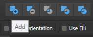
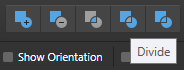
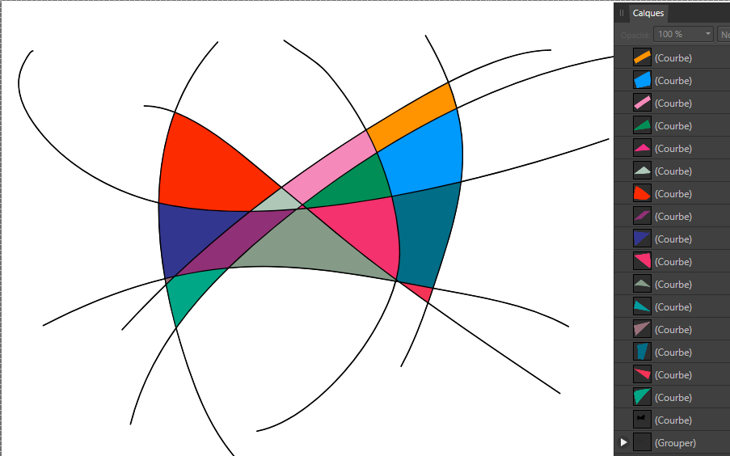

# Affinity

## Designer

### Start New Line
Double click on the last node of the pen tool to start a new line.

### Create Shapes From Linework
- Select all the lines that will be used.
- Group them (Ctrl + G)
- Duplicate that group (Ctrl + J)
	- This will make sure you don't lose your original lines.
- Make sure the newly duplicated group is selected.
- Ungroup (Ctrl + Shift + G). Make sure the lines remain highlighted in the **Layers** panel.
- Under the *Layer* menu, select *Expand Stroke*
- do a Boolean operation of *Add*
- 
- then *Divide*
- 

The result will look like the below!

