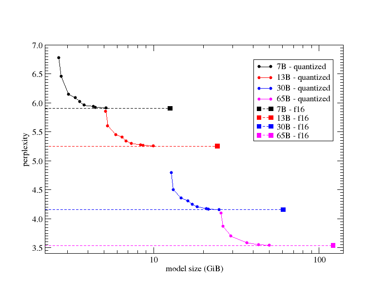
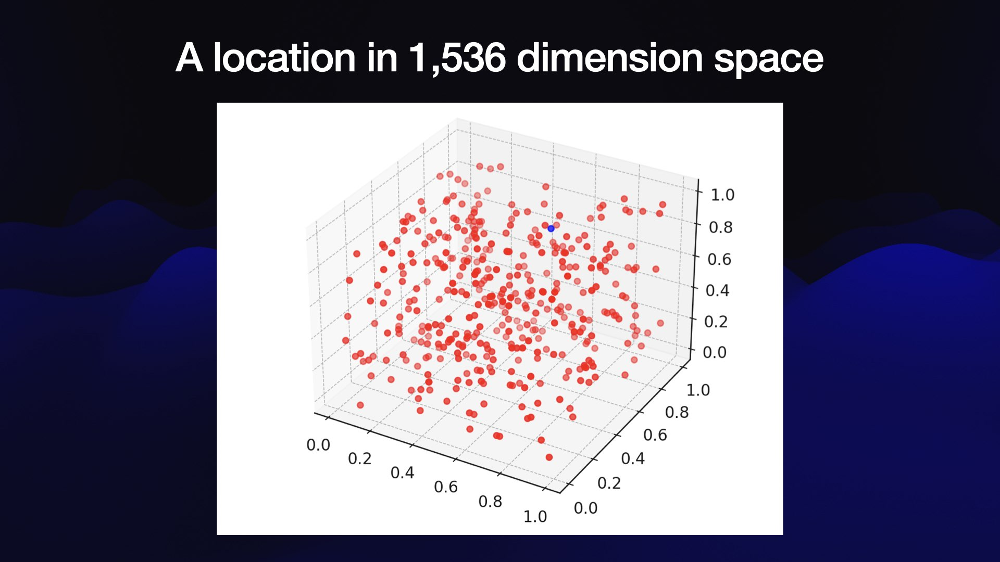

# AI

This section has to do with text generation models (same ideas as ChatGPT). See [Stable Diffusion](Stable%20Diffusion.md) for the drawing bit of AI.

**Want the TL;DR on how to run a model 100% locally?**

1. Regardless if you have a CPU or GPU, download [LM Studio](https://lmstudio.ai/). It's the best GUI I've found, and integrates with HuggingFace, can act as a API server, and allows for running on CPU, GPU, or a mix of both.
2. Open the app, and search (for example) *TheBloke/CodeLlama-7B-Instruct-GGUF* for coding, or *TheBloke/Llama-2-7B-Chat-GGM* for general chat.
3. Download the model **Quantization Q4_K_M** to start with. We can get smaller or larger ones after seeing how this one performs.
4. After it's downloaded it will appear in LM Studio under the 📂 icon in the app.
5. Make sure the code one says **CodeLlama Instruct** and the chat says **MetaAI Llama 2 Chat** in the dropdown. This loads some settings on how to interact with the model.
6. Click on the 💬 icon, **New Chat**.
7. On the right you may want to select *GPU Acceleration* under **Model Initialization** if you have one, and start with **10 layers** (we can always modify later).
8. From the top, select one of the models you downloaded and load it.
9. Chat away!

> [!tip]
> This app can run GGML and GGUF models (GGUF is the new format, while GGML is being phased out). Anything from [TheBloke](https://huggingface.co/TheBloke) seems to be good. You can add layers to the GPU if you have one. You'll notice a point of no returns as you tweak it. For a 3060 TI (8 GB), I got to about 35 layers on average before it didn't matter. For a 3090 (24 GB) I'm at 100, but I didn't creep up to it at all so the real number of layers is likely much less.

> [!info]
> There is another format called GPTQ that this software can't run. GPTQ is meant for 100% GPU, while the others can be a mix (or 100% CPU). [Oobaboga](https://github.com/oobabooga/text-generation-webui) and [ExLlama](https://github.com/turboderp/exllama) can run those, but I don't like the GUI or UX as much. I have 32 GB ram which helps a lot for larger models to load into memory.

> [!example]
> On the 3060 TI, 7B of any quantization is great. I could do up to 13B at Q4_K_M and it was good too (started quick and wrote faster than I could read). Above that quant. or higher parameters was not great. On the 3090 Any of the 30-34B Q4_K_M are super fast.

## Local Models

### GUIs

- [LM Studio](https://lmstudio.ai/)
	- Beta versions [here](https://lmstudio.ai/beta-releases.html).
- [Oobabooga](https://github.com/oobabooga/text-generation-webui)

### Coding

Can use LM studio for local APIs, then something like [Wingman](https://github.com/nvms/wingman) in VS Code to get support during programming. Also have [Continue](https://github.com/continuedev/continue), but need to make sure Wingman isn't installed with it, and that the `settings.json` file in `%appdata%\code\<username>\` doesn't have any wingman info. Seems to interfere. Can you LM studio to act as server, just make sure ports match (8000 is what Continue defaults to).

### Models

- Leaderboards [here](https://chat.lmsys.org/?leaderboard) and [here](https://tatsu-lab.github.io/alpaca_eval/)
- [TheBloke](https://huggingface.co/TheBloke) on HuggingFace offers great models.
	- [CodeLlama 13B](https://huggingface.co/models?search=thebloke/codellama)
	- [Llama 2 13B](https://huggingface.co/models?sort=trending&search=thebloke%2Fllama-2-13b)

Code Llama comes in three model sizes, and three variants, and have been trained between January 2023 and July 2023.

- Code Llama: base models designed for general code synthesis and understanding
- Code Llama - Python: designed specifically for Python
- Code Llama - Instruct: for instruction following and safer deployment

### Quantization

Good read on what this means [here](https://postgresml.org/blog/announcing-gptq-and-ggml-quantized-llm-support-for-huggingface-transformers).

- GGUF: Successor to GGML, CPU + GPU inference (but mostly CPU).
	- GGUF is a new format introduced by the llama.cpp team on August 21st 2023. It is a replacement for GGML, which is no longer supported by llama.cpp. The key benefit of GGUF is that it is a extensible, future-proof format which stores more information about the model as metadata. It also includes significantly improved tokenization code, including for the first time full support for special tokens. This should improve performance, especially with models that use new special tokens and implement custom prompt templates.
- GGML: CPU + GPU inference (but mostly CPU). No longer supported by [llama.cpp](https://github.com/ggerganov/llama.cpp).
- GPTQ: GPU inference

Note the RAM below can be split between GPU and "CPU" RAM, depending on the quantization method used. The below is an extract on a specific model, but should serve as a good guideline.

| Quant method | Bits | Use case                                                 |
| ------------ | ---- | -------------------------------------------------------- |
| Q2_K         | 2    | smallest, significant quality loss - not recommended     |
| Q3_K_S       | 3    | very small, high quality loss                            |
| Q3_K_M       | 3    | very small, high quality loss                            |
| Q3_K_L       | 3    | small, substantial quality loss                          |
| Q4_K_S       | 4    | small, greater quality loss                              |
| Q4_K_M       | 4    | medium, balanced quality - **recommended**               |
| Q5_K_S       | 5    | large, low quality loss - **recommended**                |
| Q5_K_M       | 5    | large, very low quality loss - **recommended**           |
| Q6_K         | 6    | very large, extremely low quality loss                   |
| Q8_0         | 8    | very large, extremely low quality loss - not recommended |

The following new quantization types are added to `ggml`:

- `GGML_TYPE_Q2_K` - "type-1" 2-bit quantization in super-blocks containing 16 blocks, each block having 16 weight. Block scales and mins are quantized with 4 bits. This ends up effectively using `2.5625` bits per weight (bpw)
- `GGML_TYPE_Q3_K` - "type-0" 3-bit quantization in super-blocks containing 16 blocks, each block having 16 weights. Scales are quantized with 6 bits. This end up using `3.4375` bpw.
- `GGML_TYPE_Q4_K` - "type-1" 4-bit quantization in super-blocks containing 8 blocks, each block having 32 weights. Scales and mins are quantized with 6 bits. This ends up using `4.5` bpw.
- `GGML_TYPE_Q5_K` - "type-1" 5-bit quantization. Same super-block structure as `GGML_TYPE_Q4_K` resulting in `5.5` bpw
- `GGML_TYPE_Q6_K` - "type-0" 6-bit quantization. Super-blocks with 16 blocks, each block having 16 weights. Scales are quantized with 8 bits. This ends up using `6.5625` bpw
- `GGML_TYPE_Q8_K` - "type-0" 8-bit quantization. Only used for quantizing intermediate results. The difference to the existing `Q8_0` is that the block size is 256. All 2-6 bit dot products are implemented for this quantization type.

This is exposed via `llama.cpp` quantization types that define various "quantization mixes" as follows:

- `LLAMA_FTYPE_MOSTLY_Q2_K` - uses `GGML_TYPE_Q4_K` for the `attention.vw` and `feed_forward.w2` tensors, `GGML_TYPE_Q2_K` for the other tensors.
- `LLAMA_FTYPE_MOSTLY_Q3_K_S` - uses `GGML_TYPE_Q3_K` for all tensors
- `LLAMA_FTYPE_MOSTLY_Q3_K_M` - uses `GGML_TYPE_Q4_K` for the `attention.wv`, `attention.wo`, and `feed_forward.w2` tensors, else `GGML_TYPE_Q3_K`
- `LLAMA_FTYPE_MOSTLY_Q3_K_L` - uses `GGML_TYPE_Q5_K` for the `attention.wv`, `attention.wo`, and `feed_forward.w2` tensors, else `GGML_TYPE_Q3_K`
- `LLAMA_FTYPE_MOSTLY_Q4_K_S` - uses `GGML_TYPE_Q4_K` for all tensors
- `LLAMA_FTYPE_MOSTLY_Q4_K_M` - uses `GGML_TYPE_Q6_K` for half of the `attention.wv` and `feed_forward.w2` tensors, else `GGML_TYPE_Q4_K`
- `LLAMA_FTYPE_MOSTLY_Q5_K_S` - uses `GGML_TYPE_Q5_K` for all tensors
- `LLAMA_FTYPE_MOSTLY_Q5_K_M` - uses `GGML_TYPE_Q6_K` for half of the `attention.wv` and `feed_forward.w2` tensors, else `GGML_TYPE_Q5_K`
- `LLAMA_FTYPE_MOSTLY_Q6_K`- uses 6-bit quantization (`GGML_TYPE_Q8_K`) for all tensors

As the models are currently fully loaded into memory, you will need adequate disk space to save them and sufficient RAM to load them. At the moment, memory and disk requirements are the same.

| Model  | Original size  | Quantized size (4-bit) |
|--------|----------------|------------------------|
| 7B     | 13 GB          | 3.9 GB                 |
| 13B    | 24 GB          | 7.8 GB                 |
| 30B    | 60 GB          | 19.5 GB                |
| 65B    | 120 GB         | 38.5 GB                |

### Perplexity

Simply, perplexity means to be surprised. We measure how much the model is surprised by seeing new data. The lower the perplexity, the better the training is. The take away here is it's *always* better to use a larger model, even if the quantization is greater. From a functional perspective, get the largest model (parameter-wise) you can, with the largest bit quantization until it's too slow for you to want to use.



Here are a few charts showing various models and quantization levels.

| Model | Measure      | F16    | Q4_0   | Q4_1   | Q5_0   | Q5_1   | Q8_0   |
| ----- | ------------ | ------ | ------ | ------ | ------ | ------ | ------ |
| 7B    | perplexity   | 5.9066 | 6.1565 | 6.0912 | 5.9862 | 5.9481 | 5.9070 |
| 7B    | file size    | 13.0G  | 3.5G   | 3.9G   | 4.3G   | 4.7G   | 6.7G   |
| 7B    | ms/tok @ 4th | 127    | 55     | 54     | 76     | 83     | 72     |
| 7B    | ms/tok @ 8th | 122    | 43     | 45     | 52     | 56     | 67     |
| 7B    | bits/weight  | 16.0   | 4.5    | 5.0    | 5.5    | 6.0    | 8.5    |
| 13B   | perplexity   | 5.2543 | 5.3860 | 5.3608 | 5.2856 | 5.2706 | 5.2548 |
| 13B   | file size    | 25.0G  | 6.8G   | 7.6G   | 8.3G   | 9.1G   | 13G    |
| 13B   | ms/tok @ 4th | -      | 103    | 105    | 148    | 160    | 131    |
| 13B   | ms/tok @ 8th | -      | 73     | 82     | 98     | 105    | 128    |
| 13B   | bits/weight  | 16.0   | 4.5    | 5.0    | 5.5    | 6.0    | 8.5    |

Shown another way...

| Model  | Measure     | Q2_K    | Q3_K_S  | Q3_K_M  | Q3_K_L  | Q4_0    | Q4_1    | Q4_K_S  | Q4_K_M  | Q5_0    | Q5_1    | Q5_K_S  | Q5_K_M  | Q6_K    | Q8_0    | F16    |
|--------|-------------|---------|---------|---------|---------|---------|---------|---------|---------|---------|---------|---------|---------|---------|---------|--------|
| 7B     | perplexity  | 6.7764  | 6.4571  | 6.1503  | 6.0869  | 6.1565  | 6.0912  | 6.0215  | 5.9601  | 5.9862  | 5.9481  | 5.9419  | 5.9208  | 5.9110  | 5.9070  | 5.9066 |
| 13B    | perplexity  | 5.8545  | 5.6033  | 5.4498  | 5.4063  | 5.3860  | 5.3608  | 5.3404  | 5.3002  | 5.2856  | 5.2706  | 5.2785  | 5.2638  | 5.2568  | 5.2548  | 5.2543 |

### Embeddings

Good intro [here](https://simonwillison.net/2023/Sep/4/llm-embeddings/). An embedding model lets you take a string of text - a word, sentence, paragraph or even a whole document - and turn that into an array of floating point numbers called an *embedding vector*.

I like to think of an embedding vector as a location in 1,536-dimensional space. The distance between two vectors is a measure of how semantically similar they are in meaning, at least according to the model that produced them.



“One happy dog” and “A playful hound” will end up close together, even though they don’t share any keywords. The embedding vector represents the language model’s interpretation of the meaning of the text.

### System Requirements

**8-bit Model Requirements for GPU inference**

| Model                    | VRAM Used  | Card examples          | RAM/Swap to Load* |
|--------------------------|------------|------------------------|-------------------|
| LLaMA 7B / Llama 2 7B    | 10GB       | 3060 12GB, 3080 10GB   | 24 GB             |
| LLaMA 13B / Llama 2 13B  | 20GB       | 3090, 3090 Ti, 4090    | 32 GB             |
| LLaMA 33B / Llama 2 34B  | ~40GB      | A6000 48GB, A100 40GB  | ~64 GB            |
| LLaMA 65B / Llama 2 70B  | ~80GB      | A100 80GB              | ~128 GB           |

**4-bit Model Requirements for GPU inference**

| Model                   | Minimum Total VRAM | Card examples                                             | RAM/Swap to Load* |
| ----------------------- | ------------------ | --------------------------------------------------------- | ----------------- |
| LLaMA 7B / Llama 2 7B   | 6GB                | GTX 1660, 2060, AMD 5700 XT, RTX 3050, 3060               | 6 GB              |
| LLaMA 13B / Llama 2 13B | 10GB               | AMD 6900 XT, RTX 2060 12GB, 3060 12GB, 3080, A2000        | 12 GB             |
| LLaMA 33B / Llama 2 34B | ~20GB              | RTX 3080 20GB, A4500, A5000, 3090, 4090, 6000, Tesla V100 | ~32 GB            |
| LLaMA 65B / Llama 2 70B | ~40GB              | A100 40GB, 2x3090, 2x4090, A40, RTX A6000, 8000           | ~64 GB            |

**System RAM, not VRAM, required to load the model, in addition to having enough VRAM. Not required to run the model.*

**llama.cpp Requirements for CPU inference**

| Model  | Original Size  | Quantized Size (4-bit) |
|--------|----------------|------------------------|
| 7B     | 13 GB          | 3.9 GB                 |
| 13B    | 24 GB          | 7.8 GB                 |
| 33B    | 60 GB          | 19.5 GB                |
| 65B    | 120 GB         | 38.5 GB                |

### Testing

- TL;DR. For **my** setup...
	- 33 gpu layers
	- 5 cpu threads
	- 13B q4_0 (or q4_k_m) model (any 7B model above q4_0 if it's not super complex is likely fine)

- Machine specs:
	- 3060 TI, 8 GB GDDR6 VRAM (capable of PCIe Gen 4.0 x16 = 31.5 GT/)
	- 32 GB DDR4-3200 RAM (running at 2666 MHz)
	- i5-104000 processor
	- ROG Strix B460-i motherboard (only PCIe 3.0 x16 = 15.75 GT/s)

> [!examples]
> All the 7B Llama 2 run quick and start quick, even up to the q8 version. For quality responses, 7B q5_k_m and up seem to be best in the 7B range. For 13B models seems 30 `n_gpu_layers` is best for quick startup, while 32-33 is a good balance of startup and speed; q4_0 provides best experience on this hardware. `n_threads` is best at 4. 2 and 6 took longer to start and had minimal impact on speed for 13B models.

- Seems about 10 tokens/second is a good pace. Fast enough to generate and read at the same time. All the below examples are for one question/answer session. Adding additional content on top of this will draw out the first token response.
- With the prompt `Summarize the founding of the United States of America.`, 40 for `n_gpu_layers` (unless noted otherwise) and 4 `n_threads` and `mlock` set to `true`. Each test below is a new chat.
	- Llama 2 Chat 7B q4_0 ggml
		- First token: 0.59 s
		- Speed: 50.83 tok/s
	- Llama 2 Chat 7B q5_k_m ggml
		- First token: 0.62 s
		- Speed: 42.55 tok/s
	- Llama 2 Chat 13B q2_k ggml
		- First token: 1.5 s
		- Speed: 13.61 tok/s
	- Llama 2 Chat 13B q4_0 ggml `30 GPU layers`
		- First token: 1.39 s
		- Speed: 6.41 tok/s
	- Llama 2 Chat 13B q4_0 ggml `35 GPU layers`
		- First token: 12.52 s
		- Speed: 10.42 tok/s
	- Llama 2 Chat 13B q4_0 ggml `40 GPU layers`
		- First token: 13.57 s (Changing from Default LM Studio to Llama 2 Chat prompt make this `15.10 s`).
		- Speed: 10.61 tok/s
	- Llama 2 Chat 13B q4_0 ggml `45 GPU layers`
		- First token: 15.87 s
		- Speed: 10.68 tok/s
	- Llama 2 Chat 13B q4_0 ggml `50 GPU layers`
		- First token: 18.87 s
		- Speed: 11.02 tok/s
	- Llama 2 Chat 13B q5_k_m ggml
		- First token: 18.58 s
		- Speed: 3.68 tok/s

### Llama.cpp

This covers how to build for Windows (or at least what worked for me) if you have an NVIDIA GPU. You'll also need [Git](https://git-scm.com/download/win) installed.

1. Install [Visual Studio 2022 Community](https://visualstudio.microsoft.com/vs/community/)
	1. Install **Desktop development with C++**, with the *Optional* features:
		1. `MSVC v143 - VS Code C++ x64/x86 build tools (latest)`
		2. `C++ CMake tools for Windows`
		3. `C++ AddressSanitizer`
		4. `Windows 11 SDK...`
2. Install the [CUDA Toolkit](https://developer.nvidia.com/cuda-downloads)
3. I had to copy the 4 files from CUDA to VS manually
	1. Copy the files from `C:\Program Files\NVIDIA GPU Computing Toolkit\CUDA\v12.2\extras\visual_studio_integration\MSBuildExtensions`
	2. To `C:\Program Files\Microsoft Visual Studio\2022\Community\MSBuild\Microsoft\VC\v170\BuildCustomizations`
4. Navigate to where you want the files extracted.
5. Run `git clone https://github.com/ggerganov/llama.cpp`, then `cd llama.cpp`
6. Finally run the below.

```bash
mkdir build
cd build
cmake .. -DLLAMA_CUBLAS=ON
cmake --build . --config Release
```

Once installed I ran a script like this: `D:\AI\llama.cpp\build\bin\Release\server.exe -c 4096 -ngl 100 --host 0.0.0.0 -t 16 --mlock --threads 6 -m "D:\AI\TheBloke\phind-codellama-34B-v2-GGUF\phind-codellama-34b-v2.Q4_K_M.gguf"`

All this was to get a server so I could use [Continue](https://continue.dev/) on VS Code. You can see examples of what it can do [here](https://continue.dev/docs/how-to-use-continue). The `config.py` looks like the below, which is slightly different than the [docs](https://continue.dev/docs/customization#llamacpp). Note the `server_url`.

```python

config = ContinueConfig(
    allow_anonymous_telemetry=False,
    models=Models(default=LlamaCpp(context_length=4096, model="llamacpp", timeout=300, prompt_templates={'edit': '[INST] Consider the following code:\n```\n{{code_to_edit}}\n```\nEdit the code to perfectly satisfy the following user request:\n{{user_input}}\nOutput nothing except for the code. No code block, no English explanation, no start/end tags.\n[/INST]'}, server_url="http://localhost:8080", llama_cpp_args={'stop': ['[INST]']}), unused=[]),
    system_message="",
    temperature=0.5,
    custom_commands=[
        CustomCommand(
            name="test",
```

