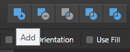
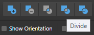
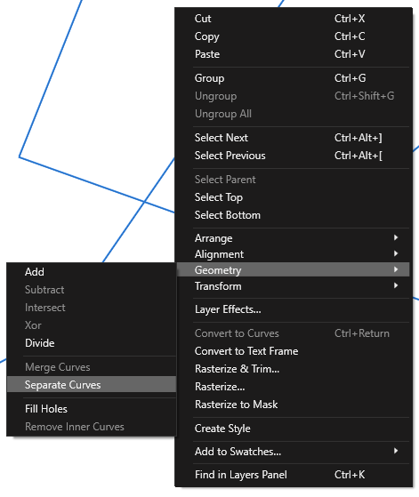
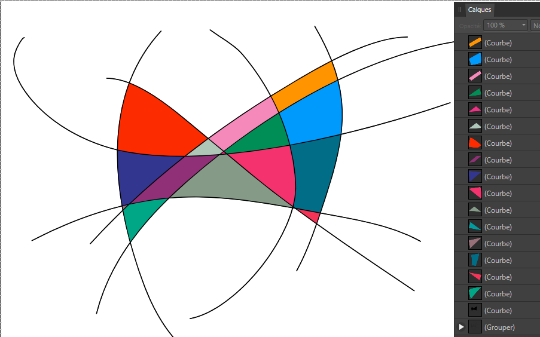

# Affinity

The company Serif offers a suite of applications for professional photo editing, publishing, graphic design and illustration. Affinity Designer, Affinity Photo, and Affinity Publisher [are those applications](https://affinity.serif.com/en-us/). They work on iPadOS, macOS, and Windows. Below are some tips and tricks.

## Designer

### Start New Line

Double click on the last node of the pen tool to start a new line.

### Create Shapes From Linework

- Select all the lines that will be used.
- Group them `(Ctrl + G)`
- Duplicate that group `(Ctrl + J)`
	- This will make sure you don't lose your original lines.
- Make sure the newly duplicated group is selected.
- Ungroup `(Ctrl + Shift + G)`. Make sure the lines remain highlighted in the **Layers** panel.
- Under the *Layer* menu, select *Expand Stroke*
- do a Boolean operation of *Add*
- 
- then *Divide*
- 

> [!warning]
> With the redesign of Designer 2, you now have the extra step to right click on the shape in the canvas (make sure the layer is selected), **Geometry**, **Separate Curves**.

The result will look like the below!

