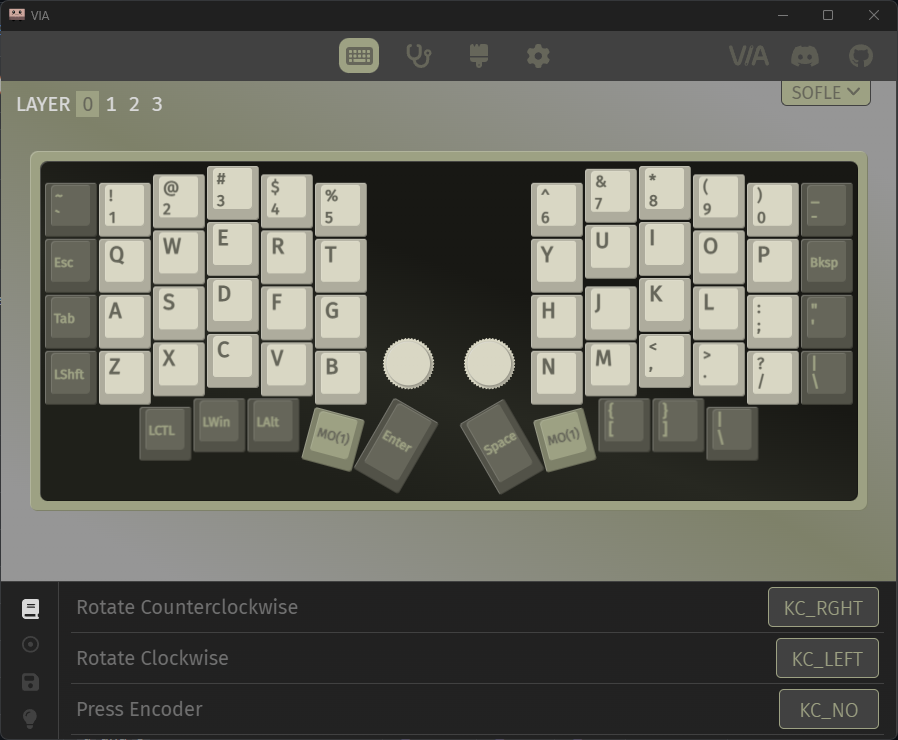

# Keyboard

## Specs

- Sofle V1
- Kailh Low Profile Choc Switches (V1) – Brown(Tactile)
- MoErgo [MCC](https://www.moergo.com/collections/mcc-keycaps) Low Profile Split Ergo Keycaps
- OLED Screens
	- 128×32 I2C OLED graphic display
- Pro Micro Type C Controllers
	- AVR ATmega32u4 8-bit microcontroller
- Choc Hotswap Sockets
- QMK firmware
	- Compatible with VIA
	- https://github.com/qmk/qmk_firmware/tree/master/keyboards/sofle
- EC11 encoder
	- 6mm stud (T18 shaft), default knob is 14mm x 17mm tall.

## Build Guide

https://choc.brianlow.com/ - useful but outdated.

## Custom Firmware

All based on the great guide [here](https://docs.qmk.fm/#/newbs_getting_started). I couldn't get QMK toolbox to flash correctly so I just used MSYS.

> [!info]
> In `../sofle/keymaps/via/rules.mk`, setting `RGBLIGHT_ENABLE = no` saved a lot of space. I don't have any RGB so no issues there.

1. Open [VIA](https://www.caniusevia.com/) in Chrome, backup your layout.
2. Clone the official QMK [repo](https://github.com/qmk/qmk_firmware).
3. Download [QMK MSYS](https://msys.qmk.fm/guide.html).
4. Open it, then run `qmk setup -H <path>`
5. Set the default keyboard with `qmk config user.keyboard=sofle/rev1`
6. Set the default keymap with `qmk config user.keymap=via`
7. Make some tweaks. Even thought I have the Sofle V1 *choc* version, the [Sofle V1 VIA](https://github.com/qmk/qmk_firmware/tree/master/keyboards/sofle/keymaps/via) version worked fine.
9. Run `qmk compile` when done. Note this compiles based on the defaults set earlier.
10. Some sites say to disconnect the cable connecting the two halves, others don't. I had no problem keeping them connected.
11. I only have to hit the reset button **Once** to get it into bootloader mode to flash.
12. Now run `qmk flash`, which will flash the firmware you just built.
13. Disconnect the USB cable and reconnect to the other half.
14. Run it again.
15. Disconnect and reconnect to left half.
16. Open VIA and import your saved layout.
17. Done!

## Custom Display

### Links

- https://joric.github.io/qle/
- https://javl.github.io/image2cpp/
- https://docs.splitkb.com/hc/en-us/articles/360013811280-How-do-I-convert-an-image-for-use-on-an-OLED-display-

### WPM

To get WPM to show up correctly, had to add `#define SPLIT_WPM_ENABLE` to `config.h`. Then in `oled.c` can output the value with `oled_write(get_u8_str(get_current_wpm(), '0'), false);`. Had to flash both sides before it stopped freaking out.

Final readout looks like this:

```c
static void print_status_narrow(void) {
    // Print current mode
    oled_write_P(PSTR("\n\n"), false);
    oled_write_ln_P(PSTR("MODE"), false);
    oled_write_P(PSTR("\n"), false);

    switch (get_highest_layer(layer_state)) {
        case 0:
            oled_write_ln_P(PSTR("base"), false);
            break;
        case 1:
            oled_write_ln_P(PSTR("alt"), false);
            break;
        default:
            oled_write_P(PSTR("mod\n"), false);
            break;
    }
    oled_write_P(PSTR("\n\n"), false);
    oled_write_ln_P(PSTR("WPM"), false);
    oled_write_P(PSTR("\n"), false);
    oled_write(get_u8_str(get_current_wpm(), '0'), false);
}
```

### Animation

Added a cool rocket animation from [github](https://github.com/JBaguley/qmk_firmware/blob/crkbd-retrograde-keymap/keyboards/crkbd/keymaps/retrograde/keymap.c). Just add the content between the comment blocks the author added. Set mine to display on the slave side, which needs `#define SPLIT_WPM_ENABLE` in `config.h`.

### Replace Default

Swap out this in `oled.c`:

```c
    static const char PROGMEM qmk_logo[] = {
        0x80,0x81,0x82,0x83,0x84,0x85,0x86,0x87,0x88,0x89,0x8a,0x8b,0x8c,0x8d,0x8e,0x8f,0x90,0x91,0x92,0x93,0x94,
        0xa0,0xa1,0xa2,0xa3,0xa4,0xa5,0xa6,0xa7,0xa8,0xa9,0xaa,0xab,0xac,0xad,0xae,0xaf,0xb0,0xb1,0xb2,0xb3,0xb4,
        0xc0,0xc1,0xc2,0xc3,0xc4,0xc5,0xc6,0xc7,0xc8,0xc9,0xca,0xcb,0xcc,0xcd,0xce,0xcf,0xd0,0xd1,0xd2,0xd3,0xd4,0
    };
    oled_write_P(qmk_logo, false);
}
```

To this:

```c
    static const char PROGMEM qmk_logo[] = {
		BIG BLOCK OF BYTECODE HERE
    };
  oled_write_raw_P(qmk_logo, sizeof(qmk_logo));
}
```

### Discord Chat

From this discussion: https://discord.com/channels/440868230475677696/440868230475677698/988633092124205096

There are some distinction here. The default `qmk_logo[]`content are actually reference to the image stored in `glcdfont.c` file. 0x80 refers to the start of the image in that file. Hence you'll use `oled_write_P` function with that variable syntax. Now that you intend to generate your own image to store inside your own array, that array content is the image itself, not a reference. So you'll need to use `oled_write_raw_P` to render that array, with a different variable syntax.

More specifically: oled_write(_P) writes out blocks, aka "characters" from the oled font file. oled_write_raw(_P) writes out the actual pixel values (the "raw" values) to be rendered to the screen.

## Layers

Here's some examples from [Keebio](https://docs.keeb.io/via#layersfn).

- `LALT(KC_TAB)` - Sends Alt-Tab
- `LCTL(KC_C)` - Sends Ctrl-C
- `LGUI(KC_C)` - Sends Cmd-C or Win-C
- `LSFT(LCTL(KC_END))` - Sends Shift-Ctrl-End
- `MO(1)` - Momentarily turn on layer 1
- `LCA(KC_DEL)` - Sends Ctrl-Alt-Del
- `MT(MOD_RSFT, KC_ENT)` - Sends Shift if held, Enter if tapped

### MO(layer)

Most commonly used layer keycode, as this is basically the equivalent to an `Fn` key. This momentarily activates the desired layer while you are holding down the key. Once released, the keyboard goes back to its original layer.

### TG(layer)

Toggles a layer on and off. Similar to Num Lock.

### DF(layer)

This turns on and off your base layer. Most folks usually have their alphas, but if you're reserving your keyboard for gaming, you can use this to maintain a custom game layer to remain active. Game on, friends!

### TO(layer)

This turns on one layer. BUT! Be aware this doesn't toggle _back_, so you need to program a key on this layer to get yourself back. Or be stuck in Kansas. Your choice.

### OSL(layer)

This temporarily activates a layer until you press the next key. OSL, standing for "one-shot layer". This is generally if you want to do one thing and then jump back to what you were doing before without having to hold down the layer key.

### TT(layer)

Smush MO and TG together and you get this. holding a key down activates the layer and it releases the layer as the key does. You can configure how many times it needs to be pressed to turn the layer on or off.

## Encoders

> [!note]
> The below covers the older style of use encoders, using **Callbacks**. The newer way (I'm using) is an **Encoder Map**. Details [here](https://docs.keeb.io/reprogramming-encoders#methods-of-mapping-encoders).

For a list of supported keys, look [here](https://github.com/qmk/qmk_firmware/blob/master/docs/keycodes_basic.md).



### Correct Jumping

Initially the keyboard jumped around with the encoders more than I wanted. Fixed by setting the resolution to 4 in `info.json` from the value 2 it was set at.

```json
    "encoder": {
        "rotary": [
            {"pin_a": "F5", "pin_b": "F4", "resolution": 4}
        ]
    },
    "split": {
        "soft_serial_pin": "D2",
        "encoder": {
            "right": {
                "rotary": [
                    {"pin_a": "F4", "pin_b": "F5", "resolution": 4}
```

### Audio Control

Simple but effective, controlling audio is what most people will do with at least one of their encoders.

```
if (clockwise) {  
  tap_code(KC_VOLU);  
} else {  
  tap_code(KC_VOLD);  
}
```

### Scrolling

There are many ways to scroll. You can use the mousewheel scroll keycodes, or simply arrow up or down a few times. My preferred way is to use Page Up and Page Down, as I find it faster and more reliable for my needs.

```
if (clockwise) {  
  tap_code(KC_PGDN);  
} else {  
  tap_code(KC_PGUP);  
}
```

### Tabbing

Moving through your browser tabs is easy enough with Control + Tab and Control + Shift + Tab, but you can also do it with an encoder.

```
if (clockwise) {  
  tap_code16(C(KC_TAB));  
} else {  
  tap_code16(S(C(KC_TAB)));  
}
```

### Window Movement

Like with tabs, you can also move through applications. In Windows, you can do this with Alt + Tab and Alt + Shift + Tab.

The code sample below is a modified version of the Alt Tab with a macro version listed in the [QMK documentation about Macros](https://beta.docs.qmk.fm/using-qmk/advanced-keycodes/feature_macros#super-alt-tab).

Alt Tab with an encoder involves adding three pieces of code. Add the first bit at the top of your `keymap.c`:

```
bool is_alt_tab_active = false;  
uint16_t alt_tab_timer = 0;
```

Second, place this piece of code in your encoder code. It will start holding Alt if it's not holding it yet, and send a tab for each click you turn on the encoder.

```
if (clockwise) {  
  if (!is_alt_tab_active) {  
    is_alt_tab_active = true;  
    register_code(KC_LALT);  
  }  
  alt_tab_timer = timer_read();  
  tap_code16(KC_TAB);  
} else {  
  if (!is_alt_tab_active) {  
    is_alt_tab_active = true;  
    register_code(KC_LALT);  
  }  
  alt_tab_timer = timer_read();  
  tap_code16(S(KC_TAB));  
}
```

And last, the part that makes it all work. This'll release Alt for you if you haven't send a tab yet in a second. You can change the 1250 part (in milliseconds) to be higher or lower if you prefer. If `matrix_scan_user` already exists, add the body of the function below to the already existing function:

```
void matrix_scan_user(void) {  
  if (is_alt_tab_active) {  
    if (timer_elapsed(alt_tab_timer) > 1250) {  
      unregister_code(KC_LALT);  
      is_alt_tab_active = false;  
    }  
  }  
}  
```

### History Scrubbing

This will perform Control + Z when you turn the encoder clockwise, and Control + Y when turning it counterclockwise. With this, you can easily "scroll" through the history when editing a document. In some Adobe products, Control + Shift + Z is used for undo. You can hold Shift while turning counterclockwise to undo in that case.

```
if (clockwise) {  
  tap_code16(C(KC_Y));  
} else {  
  tap_code16(C(KC_Z));  
}
```

### Scrolling Horizontally by Word

This will perform Control + Right Arrow when you turn the encoder clockwise, and Control + Left Arrow when turning it counterclockwise. If you hold shift while turning the encoder, you'll be able to select words while the cursor moves!

```
if (clockwise) {  
  tap_code16(C(KC_RGHT));  
} else {  
  tap_code16(C(KC_LEFT));  
}
```

### Scrolling Through Search Results

When you search for something in your text editor, often you'll also have shortcuts to move to the next or previous result. In Visual Studio Code, these are F3 and Shift + F3. Here's how to do that on an encoder:

```
if (clockwise) {  
  tap_code(KC_F3);  
} else {  
  tap_code16(S(KC_F3));  
}
```
