# Stable Diffusion

Stable Diffusion is a deep learning, text-to-image model released in 2022. It is primarily used to generate detailed images conditioned on text descriptions, though it can also be applied to other tasks such as inpainting, outpainting, and generating image-to-image translations guided by a text prompt.

## Current Directory

`%userprofile%\stable-diffusion-webui`

## Prompts

A good default negative prompt to include in all prompts, which works best with 2.0 models and higher, is:

```
cropped, lowres, poorly drawn face, out of frame, poorly drawn hands, blurry, bad art, blurred, text, watermark, disfigured, deformed, closed eyes
```

The rest of the below are some interesting ones used in the past. Also check out https://prompthero.com/ and https://lexica.art/ for more ideas.

```
85mm vibrant food photo of a chocolate lasagne on a plate on a table at a restaurant. dof. bokeh. soft light. by harry fayt. centered. extremely detailed. Nikon D850. award winning photography 
```

```
A beautiful greek temple with colorful gases and dusts by Stephan Martiniere and Cameron Gray, trending on Artstation
```

```
an army man taking a selfie on the trenches of war, close up shoot, 50mm f2.8,tilt-shift,hyperrealism, super detailed, pencil sketch, trending on artstation, under exposed
```

```
a portrait of intergalactic robot, grim - lighting, high - contrast, intricate, elegant, highly detailed, centered, digital painting, artstation, concept art, smooth, sharp focus, illustration, artgerm, tomasz alen kopera, peter mohrbacher, donato giancola, joseph christian leyendecker, wlop, boris vallejo
```

```
beautiful vintage painting of a hummingbird, insanely detailed, traditional art, old, artistic, art by Katsushika Hokusai
```
 
```
full portrait of robot cat, 1970 style,realistic proportions, highly detailed, smooth, sharp focus, 8k, ray tracing, digital painting, concept art illustration by artgerm greg rutkowski alphonse mucha trending on artstation, nikon d850
```

```
Clean, sharp, vectorized logo of a dystopian sci-fi megacorporation named Amazon. Company logo, icon, trending, modern and minimalist
```

```
extremely beautiful softly lit interior photo of futuristic construction machinery, pneumatic, hydraulic, exoskeleton, yellow, white black, bar codes, logos, details, graphic, excavator, backhoe, black, polished metal, gleaming, black and white corporate decals, polished concrete floor, sharp focus, clear focus, beautiful, award winning photo, extremely beautiful lighting, cinematic, modern, render, architectural, architecture, realistic, clear 
```

```
borg, empty, deep space, detailed space ship, interstellar, octane render, unreal engine, hyper detailed, digital painting, artstation, concept art, smooth, sharp focus, illustration, art by artgerm and greg rutkowski and alphonse mucha
```

```
photograph national geographic mountain landscape magic the gathering John Avon, black, atmospheric, 8k high definition
```

## AUTOMATIC1111

1.  Install [Python 3.10.6](https://www.python.org/downloads/windows/), checking "Add Python to PATH"
2.  Install [git](https://git-scm.com/download/win).
3.  Download the stable-diffusion-webui repository, for example by running `git clone https://github.com/AUTOMATIC1111/stable-diffusion-webui.git`.
4.  Place `model.ckpt` in the `models` directory (see [dependencies](https://github.com/AUTOMATIC1111/stable-diffusion-webui/wiki/Dependencies) for where to get it).
5.  __(Optional)__ Place `GFPGANv1.4.pth` in the base directory, alongside `webui.py` (see [dependencies](https://github.com/AUTOMATIC1111/stable-diffusion-webui/wiki/Dependencies) for where to get it).
6.  Run `webui-user.bat` from Windows Explorer as normal, non-administrator, user.

### Features

Below is from the wiki [here](https://github.com/AUTOMATIC1111/stable-diffusion-webui/wiki/Features).

#### Stable Diffusion 2.0 Basic Models

Models are supported: 768-v-ema.ckpt ([model](https://huggingface.co/stabilityai/stable-diffusion-2/blob/main/768-v-ema.ckpt), [config](https://raw.githubusercontent.com/Stability-AI/stablediffusion/main/configs/stable-diffusion/v2-inference-v.yaml)) and 512-base-ema.ckpt ([model](https://huggingface.co/stabilityai/stable-diffusion-2-base/blob/main/512-base-ema.ckpt), [config](https://raw.githubusercontent.com/Stability-AI/stablediffusion/main/configs/stable-diffusion/v2-inference.yaml)). 2.1 checkpoints should also work.

- download the checkpoint (from here: https://huggingface.co/stabilityai/stable-diffusion-2)
- put it into `models/Stable-Diffusion` directory
- grab the config from SD2.0 repository and put it into same place as the checkpoint, renaming it to have same filename (i.e. if your checkpoint is named `768-v-ema.ckpt`, the config should be named `768-v-ema.yaml`)
- select the new checkpoint from the UI

Train tab will most likely be broken for the 2.0 models.

If 2.0 or 2.1 is generating black images, enable full precision with `--no-half` or try using the `--xformers` optimization.

_**Note:**_ SD 2.0 and 2.1 are more sensitive to FP16 numerical instability (as noted by themselves [here](https://github.com/Stability-AI/stablediffusion/commit/c12d960d1ee4f9134c2516862ef991ec52d3f59e)) due to their new cross attention module.

On fp16: [comment](https://github.com/AUTOMATIC1111/stable-diffusion-webui/issues/5503#issuecomment-1341495770) to enable, in webui-user.bat:

    @echo off

    set PYTHON=
    set GIT=
    set VENV_DIR=
    set COMMANDLINE_ARGS=your command line options
    set STABLE_DIFFUSION_COMMIT_HASH="c12d960d1ee4f9134c2516862ef991ec52d3f59e"
    set ATTN_PRECISION=fp16

    call webui.bat

#### Stable Diffusion 2.0 Depth Models

[More info](https://github.com/Stability-AI/stablediffusion#depth-conditional-stable-diffusion). [PR](https://github.com/AUTOMATIC1111/stable-diffusion-webui/pull/5542).
Instructions:
- download the [512-depth-ema.ckpt](https://huggingface.co/stabilityai/stable-diffusion-2-depth) checkpoint
- place it in models/Stable-diffusion
- grab the [config](https://raw.githubusercontent.com/Stability-AI/stablediffusion/main/configs/stable-diffusion/v2-midas-inference.yaml) and place it in the same folder as the checkpoint
- rename the config to `512-depth-ema.yaml`
- select the new checkpoint from the UI

The depth-guided model will only work in img2img tab.

#### Outpainting

Outpainting extends the original image and inpaints the created empty space.

Example:

| Original                     | Outpainting                   | Outpainting again            |
|------------------------------|------------------------------|------------------------------|
|  | 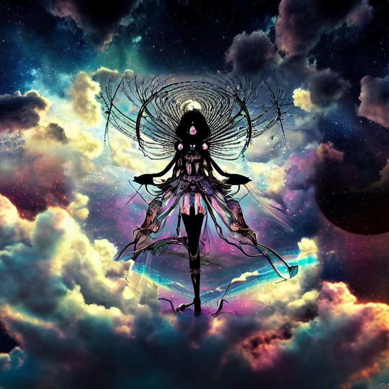 |  |

Original image by Anonymous user from 4chan. Thank you, Anonymous user.

You can find the feature in the img2img tab at the bottom, under Script -> Poor man's outpainting.

Outpainting, unlike normal image generation, seems to profit very much from large step count. A recipe for a good outpainting
is a good prompt that matches the picture, sliders for denoising and CFG scale set to max, and step count of 50 to 100 with
Euler ancestral or DPM2 ancestral samplers.

| 81 steps, Euler A                   | 30 steps, Euler A                     | 10 steps, Euler A                    | 80 steps, Euler A                   |
|-------------------------------------|---------------------------------------|--------------------------------------|-------------------------------------|
| 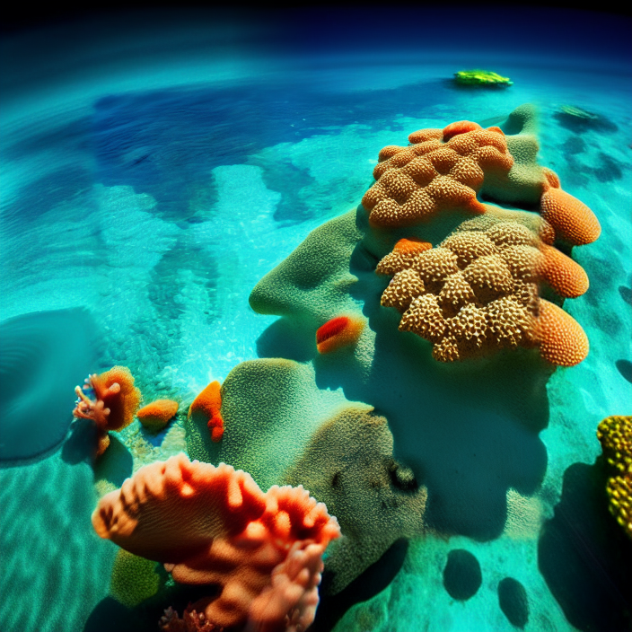 |  | 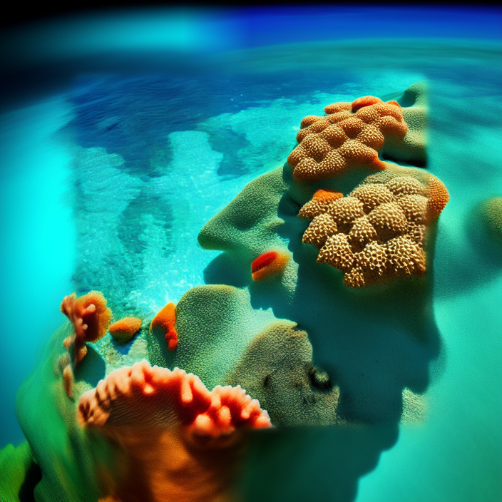 |  |

#### Inpainting

In img2img tab, draw a mask over a part of the image, and that part will be in-painted.


Options for inpainting:
- draw a mask yourself in the web editor
- erase a part of the picture in an external editor and upload a transparent picture. Any even slightly transparent areas will become part of the mask. Be aware that [some editors](https://docs.krita.org/en/reference_manual/layers_and_masks/split_alpha.html#how-to-save-a-png-texture-and-keep-color-values-in-fully-transparent-areas) save completely transparent areas as black by default.
- change mode (to the bottom right of the picture) to "Upload mask" and choose a separate black and white image for the mask (white=inpaint).

##### Inpainting model

RunwayML has trained an additional model specifically designed for inpainting. This model accepts additional inputs - the initial image without noise plus the mask - and seems to be much better at the job.

Download and extra info for the model is here: https://github.com/runwayml/stable-diffusion#inpainting-with-stable-diffusion

To use the model, you must rename the checkpoint so that its filename ends in `inpainting.ckpt`, for example, `1.5-inpainting.ckpt`.

After that just select the checkpoint as you'd usually select any checkpoint and you're good to go.

##### Masked content

The masked content field determines content is placed to put into the masked regions before they are inpainted.

| mask                                            | fill                                            | original                                            | latent noise                                            | latent nothing                                            |
|-------------------------------------------------|-------------------------------------------------|-----------------------------------------------------|---------------------------------------------------------|-----------------------------------------------------------|
| 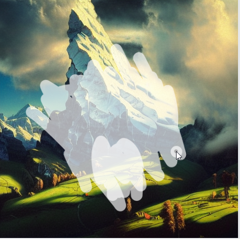 |  | 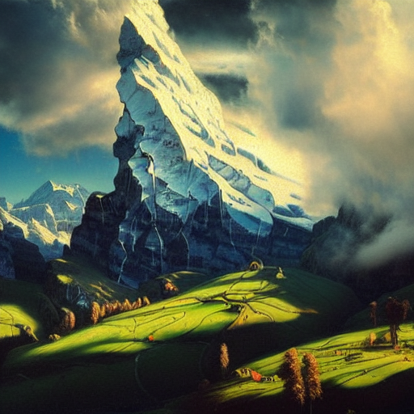 |  | 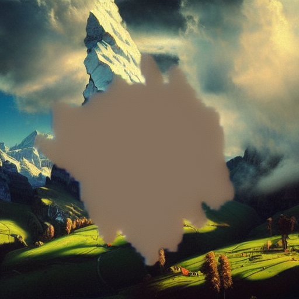 |

##### Inpaint area

Normally, inpainting resizes the image to the target resolution specified in the UI. With `Inpaint area: Only masked`
enabled, only the masked region is resized, and after processing it is pasted back to the original picture.
This allows you to work with large pictures and render the inpainted object at a much larger resolution.


| Input                               | Inpaint area: Whole picture                   | Inpaint area: Only masked       |
|-------------------------------------|----------------------------------|-----------------------------------|
| 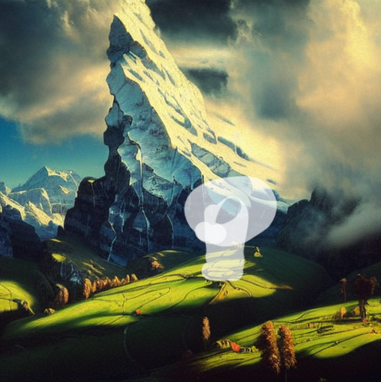  | 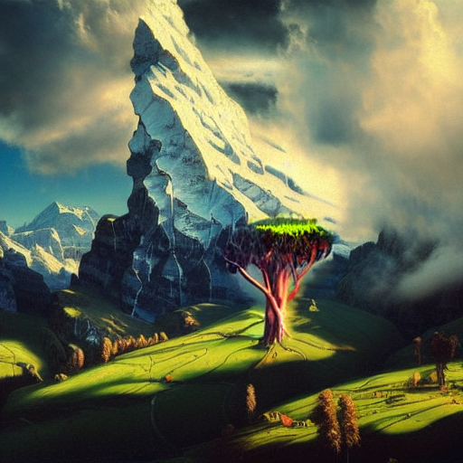 |  |

##### Masking mode

There are two options for masked mode:
- Inpaint masked - the region under the mask is inpainted
- Inpaint not masked - under the mask is unchanged, everything else is inpainted

##### Alpha mask

| Input                        | Output                        |
|------------------------------|-------------------------------|
| 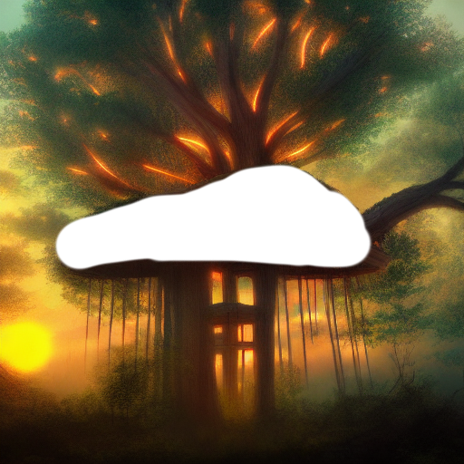 |  |

#### Prompt matrix

Separate multiple prompts using the `|` character, and the system will produce an image for every combination of them.
For example, if you use `a busy city street in a modern city|illustration|cinematic lighting` prompt, there are four combinations possible (first part of the prompt is always kept):

- `a busy city street in a modern city`
- `a busy city street in a modern city, illustration`
- `a busy city street in a modern city, cinematic lighting`
- `a busy city street in a modern city, illustration, cinematic lighting`

Four images will be produced, in this order, all with the same seed and each with a corresponding prompt:


Another example, this time with 5 prompts and 16 variations:
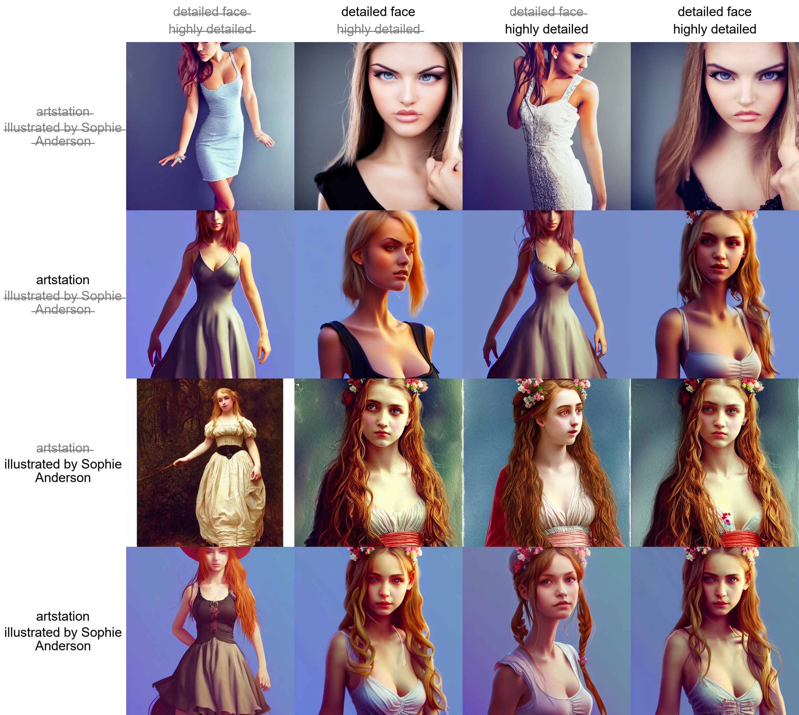

You can find the feature at the bottom, under Script -> Prompt matrix.

#### Color Sketch

Basic coloring tool for img2img. To use this feature in img2img, enable with `--gradio-img2img-tool color-sketch` in commandline args. To use this feature in inpainting mode, enable with `--gradio-inpaint-tool color-sketch`. Chromium-based browsers support a dropper tool. (see picture)

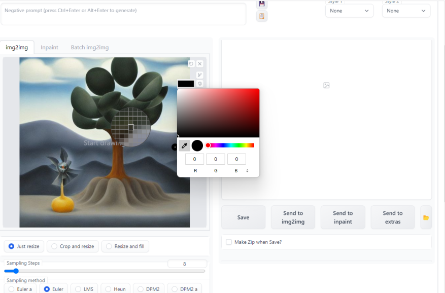

#### Stable Diffusion upscale

Upscale image using RealESRGAN/ESRGAN and then go through tiles of the result, improving them with img2img.
It also has an option to let you do the upscaling part yourself in an external program, and just go through tiles with img2img.

Original idea by: https://github.com/jquesnelle/txt2imghd. This is an independent implementation.

To use this feature, select `SD upscale from the scripts dropdown selection` (img2img tab).

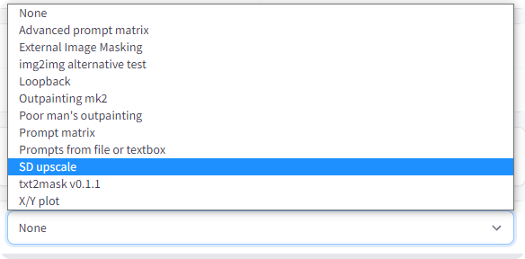

The input image will be upscaled to twice the original
width and height, and UI's width and height sliders specify the size of individual tiles. Because of overlap,
the size of the tile can be very important: 512x512 image needs nine 512x512 tiles (because of overlap), but only
four 640x640 tiles.

Recommended parameters for upscaling:
 - Sampling method: Euler a
 - Denoising strength: 0.2, can go up to 0.4 if you feel adventurous

| Original                                  | RealESRGAN                                  | Topaz Gigapixel                                         | SD upscale                                  |
|-------------------------------------------|---------------------------------------------|---------------------------------------------------------|---------------------------------------------|
|  | 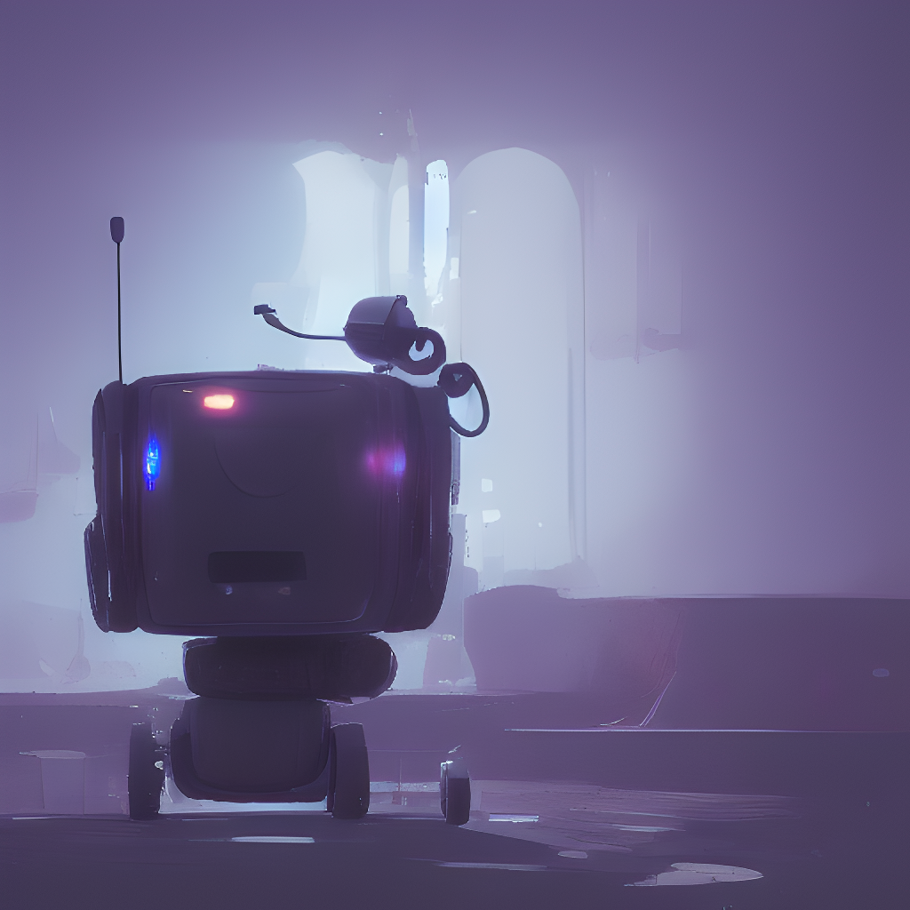 | 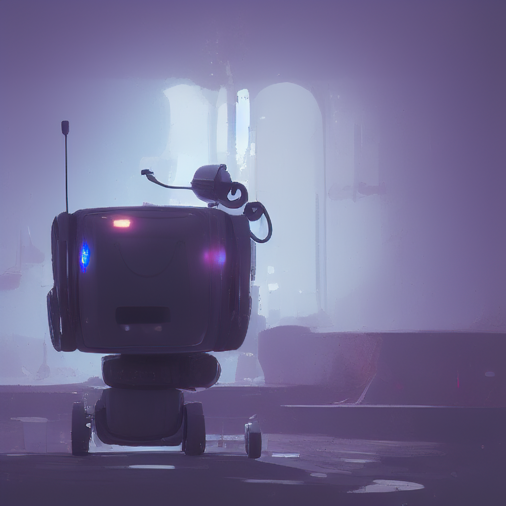 |  |
| 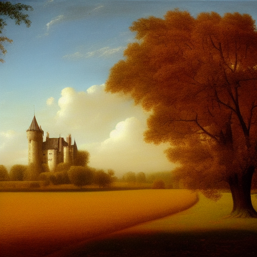 |  |  |  |
|   | 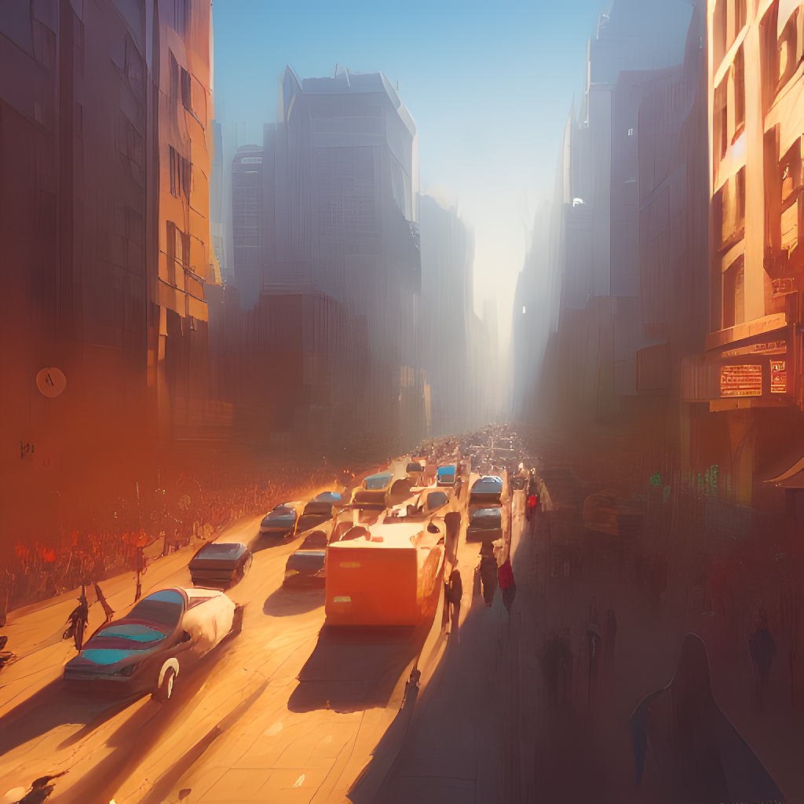  |   | 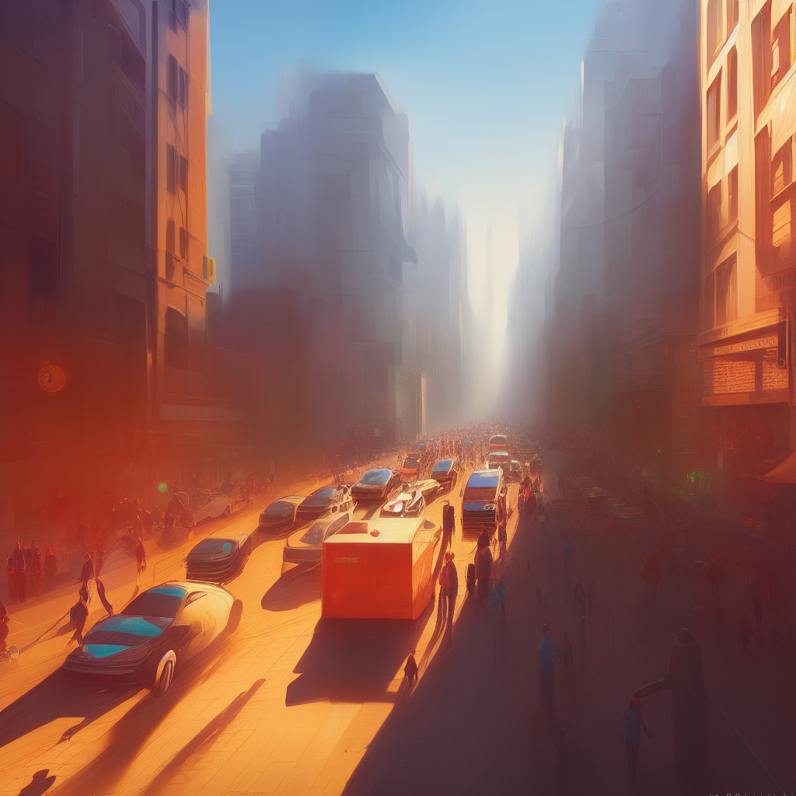  |

#### Attention/emphasis

Using `()` in the prompt increases the model's attention to enclosed words, and `[]` decreases it. You can combine multiple modifiers:


Cheat sheet:

 - `a (word)` - increase attention to `word` by a factor of 1.1
 - `a ((word))` - increase attention to `word` by a factor of 1.21 (= 1.1 * 1.1)
 - `a [word]` - decrease attention to `word` by a factor of 1.1
 - `a (word:1.5)` - increase attention to `word` by a factor of 1.5
 - `a (word:0.25)` - decrease attention to `word` by a factor of 4 (= 1 / 0.25)
 - `a \(word\)` - use literal `()` characters in prompt

With `()`, a weight can be specified like this: `(text:1.4)`. If the weight is not specified, it is assumed to be 1.1. Specifying weight only works with `()` not with `[]`.

If you want to use any of the literal `()[]` characters in the prompt, use the backslash to escape them: `anime_\(character\)`.

On 2022-09-29, a new implementation was added that supports escape characters and numerical weights. A downside of the new implementation is that the old one was not perfect and sometimes ate characters: "a (((farm))), daytime", for example, would become "a farm daytime" without the comma. This behavior is not shared by the new implementation which preserves all text correctly, and this means that your saved seeds may produce different pictures. For now, there is an option in settings to use the old implementation.

NAI uses my implementation from before 2022-09-29, except they have 1.05 as the multiplier and use `{}` instead of `()`. So the conversion applies:

 - their `{word}` = our `(word:1.05)`
 - their `{{word}}` = our `(word:1.1025)`
 - their `[word]` = our `(word:0.952)` (0.952 = 1/1.05)
 - their `[[word]]` = our `(word:0.907)` (0.907 = 1/1.05/1.05)

#### Loopback

Selecting the loopback script in img2img allows you to automatically feed output image as input for the next batch. Equivalent to
saving output image, and replacing the input image with it. Batch count setting controls how many iterations of
this you get.

Usually, when doing this, you would choose one of many images for the next iteration yourself, so the usefulness
of this feature may be questionable, but I've managed to get some very nice outputs with it that I wasn't able
to get otherwise.

Example: (cherrypicked result)

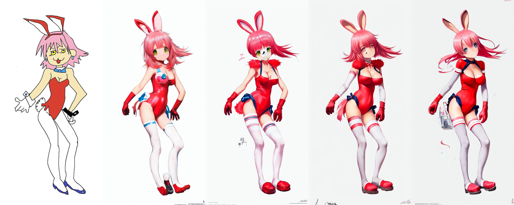

Original image by Anonymous user from 4chan. Thank you, Anonymous user.

#### X/Y plot

Creates a grid of images with varying parameters. Select which parameters should be shared by rows and columns using
X type and Y type fields, and input those parameters separated by comma into X values/Y values fields. For integer,
and floating point numbers, and ranges are supported. Examples:

- Simple ranges:
  - `1-5` = 1, 2, 3, 4, 5
- Ranges with increment in bracket:
  - `1-5 (+2)` = 1, 3, 5
  - `10-5 (-3)` = 10, 7
  - `1-3 (+0.5)` = 1, 1.5, 2, 2.5, 3
- Ranges with the count in square brackets:
  - `1-10 [5]` = 1, 3, 5, 7, 10
  - `0.0-1.0 [6]` = 0.0, 0.2, 0.4, 0.6, 0.8, 1.0


Here are the settings that create the graph above:

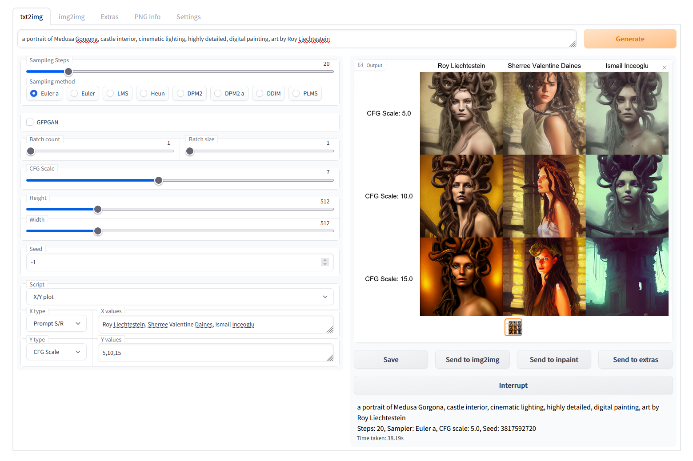

##### Prompt S/R

Prompt S/R is one of more difficult to understand modes of operation for X/Y Plot. S/R stands for search/replace, and that's what it does - you input a list of words or phrases, it takes the first from the list and treats it as keyword, and replaces all instances of that keyword with other entries from  the list.

For example, with prompt `a man holding an apple, 8k clean`, and Prompt S/R `an apple, a watermelon, a gun` you will get three prompts:

- `a man holding an apple, 8k clean`
- `a man holding a watermelon, 8k clean`
- `a man holding a gun, 8k clean`

The list uses the same syntax as a line in a CSV file, so if you want to include commas into your entries you have to put text in quotes and make sure there is no space between quotes and separating commas:

- `darkness, light, green, heat` - 4 items - `darkness`, `light`, `green`, `heat`
- `darkness, "light, green", heat` - WRONG - 4 items - `darkness`, `"light`, `green"`, `heat`
- `darkness,"light, green",heat` - RIGHT - 3 items - `darkness`, `light, green`, `heat`

#### Textual Inversion

Short explanation: place your embeddings into the `embeddings` directory, and use the filename in the prompt.

Long explanation: [Textual Inversion](Textual-Inversion)

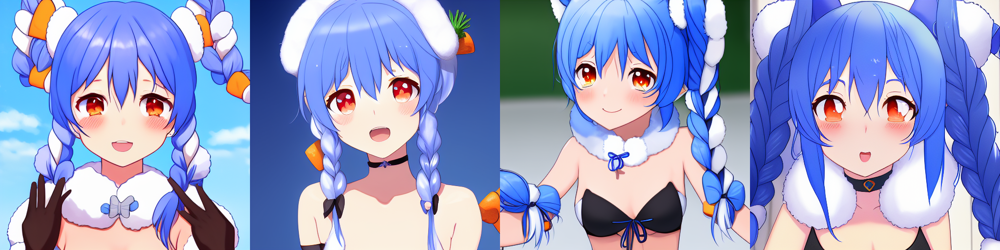

#### Resizing

There are three options for resizing input images in img2img mode:

- Just resize - simply resizes the source image to the target resolution, resulting in an incorrect aspect ratio
- Crop and resize - resize source image preserving aspect ratio so that entirety of target resolution is occupied by it, and crop parts that stick out
- Resize and fill - resize source image preserving aspect ratio so that it entirely fits target resolution, and fill empty space by rows/columns from the source image

Example:
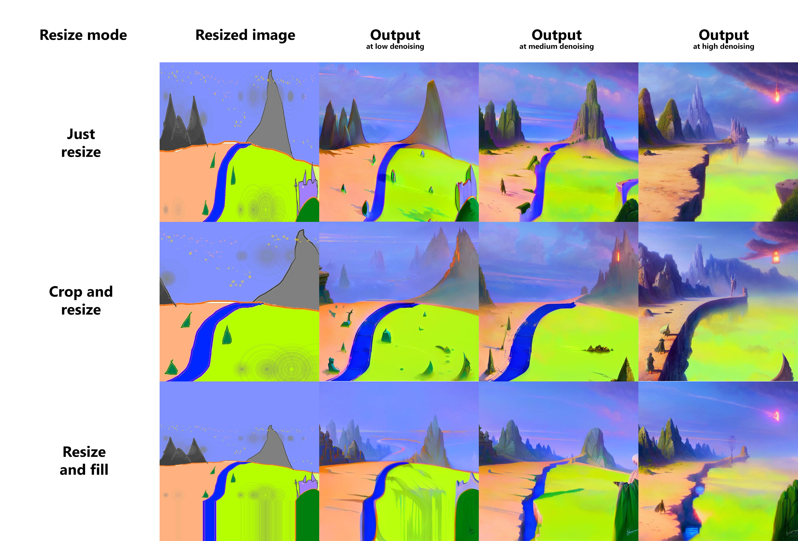

#### Sampling method selection

Pick out of multiple sampling methods for txt2img:


#### Seed resize

This function allows you to generate images from known seeds at different resolutions. Normally, when you change resolution,
the image changes entirely, even if you keep all other parameters including seed. With seed resizing you specify the resolution
of the original image, and the model will very likely produce something looking very similar to it, even at a different resolution.
In the example below, the leftmost picture is 512x512, and others are produced with exact same parameters but with larger vertical
resolution.

| Info                      | Image                         |
|---------------------------|-------------------------------|
| Seed resize not enabled   | 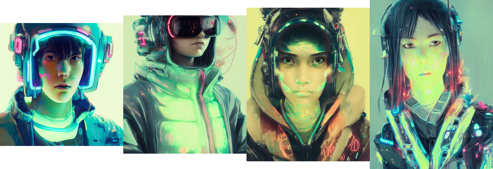 |
| Seed resized from 512x512 | 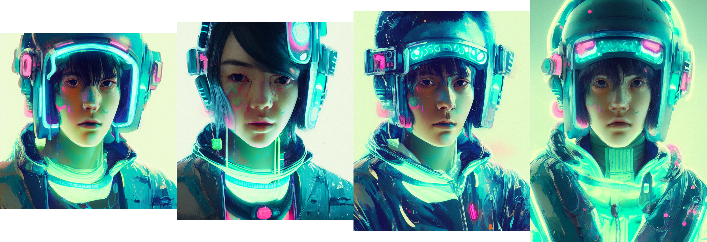   |

Ancestral samplers are a little worse at this than the rest.

You can find this feature by clicking the "Extra" checkbox near the seed.

#### Variations

A Variation strength slider and Variation seed field allow you to specify how much the existing picture should be altered to look
like a different one. At maximum strength, you will get pictures with the Variation seed, at minimum - pictures with the original Seed (except
for when using ancestral samplers).

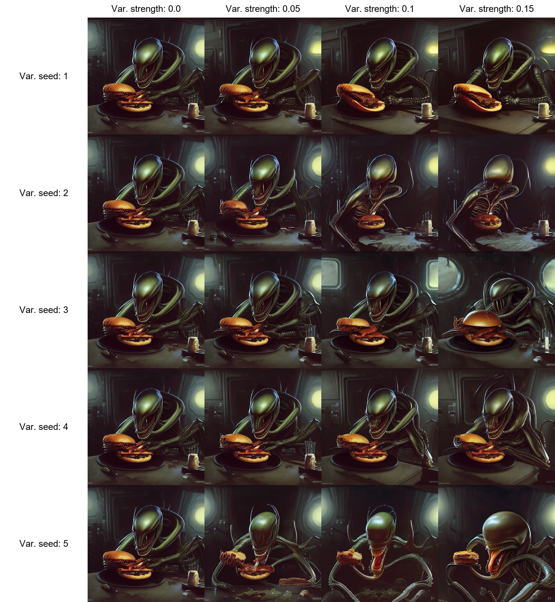

You can find this feature by clicking the "Extra" checkbox near the seed.

#### Styles

Press the "Save prompt as style" button to write your current prompt to styles.csv, the file with a collection of styles. A dropbox to
the right of the prompt will allow you to choose any style out of previously saved, and automatically append it to your input.
To delete a style, manually delete it from styles.csv and restart the program.

if you use the special string `{prompt}` in your style, it will substitute anything currently in the prompt into that position, rather than appending the style to your prompt.

#### Negative prompt

Allows you to use another prompt of things the model should avoid when generating the picture. This works by using the
negative prompt for unconditional conditioning in the sampling process instead of an empty string.

Advanced explanation: [Negative prompt](Negative-prompt)

| Original                      | Negative: purple                | Negative: tentacles                |
|-------------------------------|---------------------------------|------------------------------------|
|  |  |  |

#### CLIP interrogator

Originally by: https://github.com/pharmapsychotic/clip-interrogator

CLIP interrogator allows you to retrieve the prompt from an image. The prompt won't allow you to reproduce this
exact image (and sometimes it won't even be close), but it can be a good start.


The first time you run CLIP interrogator it will download a few gigabytes of models.

CLIP interrogator has two parts: one is a BLIP model that creates a text description from the picture.
Other is a CLIP model that will pick few lines relevant to the picture out of a list. By default, there
is only one list - a list of artists (from `artists.csv`). You can add more lists by doing the following:

 - create `interrogate` directory in the same place as webui
 - put text files in it with a relevant description on each line

For example of what text files to use, see https://github.com/pharmapsychotic/clip-interrogator/tree/main/clip_interrogator/data.
In fact, you can just take files from there and use them - just skip artists.txt because you already have a list of
artists in `artists.csv` (or use that too, who's going to stop you). Each file adds one line of text to the final description.
If you add ".top3." to filename, for example, `flavors.top3.txt`, the three most relevant lines from this file will be
added to the prompt (other numbers also work).

There are settings relevant to this feature:
 - `Interrogate: keep models in VRAM` - do not unload Interrogate models from memory after using them. For users with a lot of VRAM.
 - `Interrogate: use artists from artists.csv` - adds artist from `artists.csv` when interrogating. Can be useful to disable when you have your list of artists in `interrogate` directory
 - `Interrogate: num_beams for BLIP` - parameter that affects how detailed descriptions from BLIP model are (the first part of generated prompt)
 - `Interrogate: minimum description length` - minimum length for BLIP model's text
 - `Interrogate: maximum descripton length` - maximum length for BLIP model's text
 - `Interrogate: maximum number of lines in text file` - interrogator will only consider this many first lines in a file. Set to 0, the default is 1500, which is about as much as a 4GB videocard can handle.

#### Prompt editing

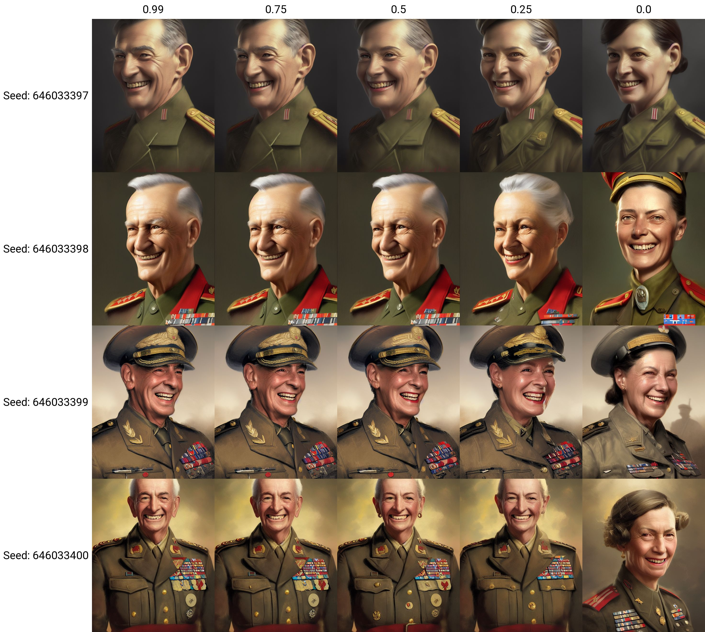

Prompt editing allows you to start sampling one picture, but in the middle swap to something else. The base syntax for this is:

```
[from:to:when]
```

Where `from` and `to` are arbitrary texts, and `when` is a number that defines how late in the sampling cycle should the switch be made. The later it is, the less power the model has to draw the `to` text in place of `from` text. If `when` is a number between 0 and 1, it's a fraction of the number of steps after which to make the switch. If it's an integer greater than zero, it's just the step after which to make the switch.

Nesting one prompt editing inside another does work.

Additionally:
- `[to:when]` - adds `to` to the prompt after a fixed number of steps (`when`)
- `[from::when]` - removes `from` from the prompt after a fixed number of steps (`when`)

Example:
`a [fantasy:cyberpunk:16] landscape`

- At start, the model will be drawing `a fantasy landscape`.
- After step 16, it will switch to drawing `a cyberpunk landscape`, continuing from where it stopped with fantasy.

Here's a more complex example with multiple edits:
`fantasy landscape with a [mountain:lake:0.25] and [an oak:a christmas tree:0.75][ in foreground::0.6][ in background:0.25] [shoddy:masterful:0.5]` (sampler has 100 steps)

- at start, `fantasy landscape with a mountain and an oak in foreground shoddy`
- after step 25, `fantasy landscape with a lake and an oak in foreground in background shoddy`
- after step 50, `fantasy landscape with a lake and an oak in foreground in background masterful`
- after step 60, `fantasy landscape with a lake and an oak in background masterful`
- after step 75, `fantasy landscape with a lake and a christmas tree in background masterful`

The picture at the top was made with the prompt:

`Official portrait of a smiling world war ii general, [male:female:0.99], cheerful, happy, detailed face, 20th century, highly detailed, cinematic lighting, digital art painting by Greg Rutkowski's

And the number 0.99 is replaced with whatever you see in column labels on the image.

The last column in the picture is [male:female:0.0], which essentially means that you are asking the model to draw a female from the start, without starting with a male general, and that is why it looks so different from others.

##### Alternating Words

Convenient Syntax for swapping every other step.

    [cow|horse] in a field

On step 1, prompt is "cow in a field." Step 2 is "horse in a field." Step 3 is "cow in a field" and so on.


See more advanced example below. On step 8, the chain loops back from "man" to "cow."

    [cow|cow|horse|man|siberian tiger|ox|man] in a field

Prompt editing was first implemented by Doggettx in [this myspace.com post](https://www.reddit.com/r/StableDiffusion/comments/xas2os/simple_prompt2prompt_implementation_with_prompt/).

#### Hires. fix

A convenience option to partially render your image at a lower resolution, upscale it, and then add details at a high resolution. By default, txt2img  makes horrible images at very high resolutions, and this makes it possible to avoid using the small picture's composition. Enabled by checking the "Hires. fix" checkbox on the txt2img page.

| Without                      | With                |
|-------------------------------|---------------------------------|
| 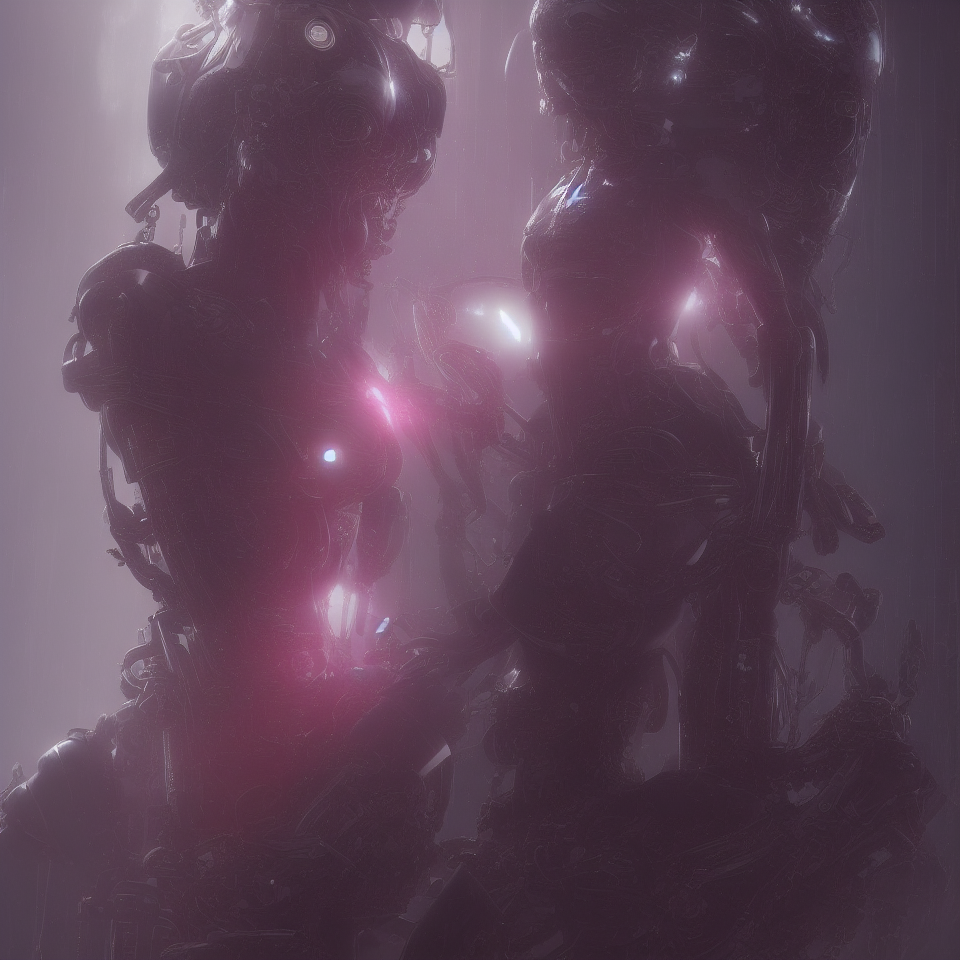 | 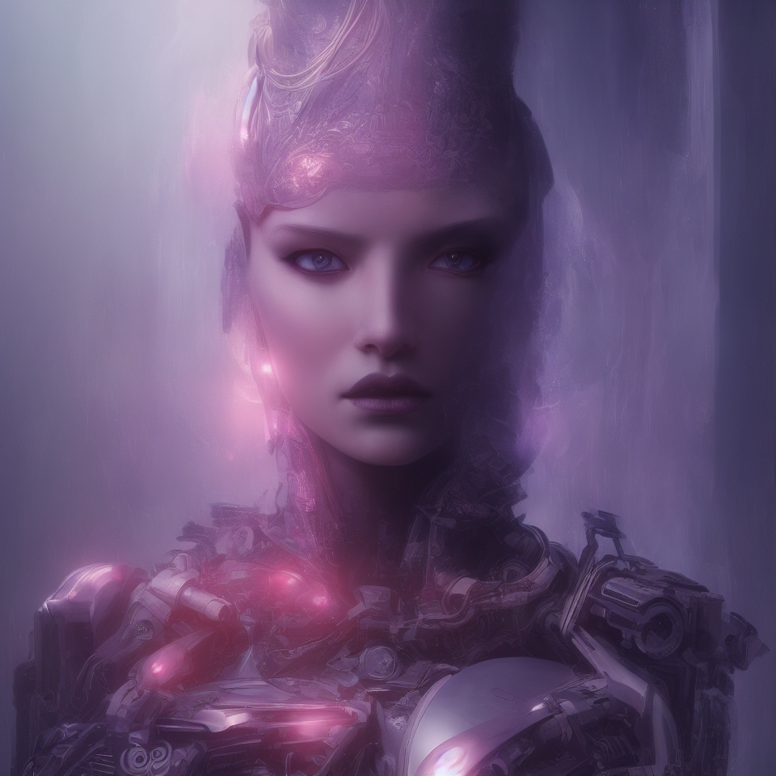 |
| 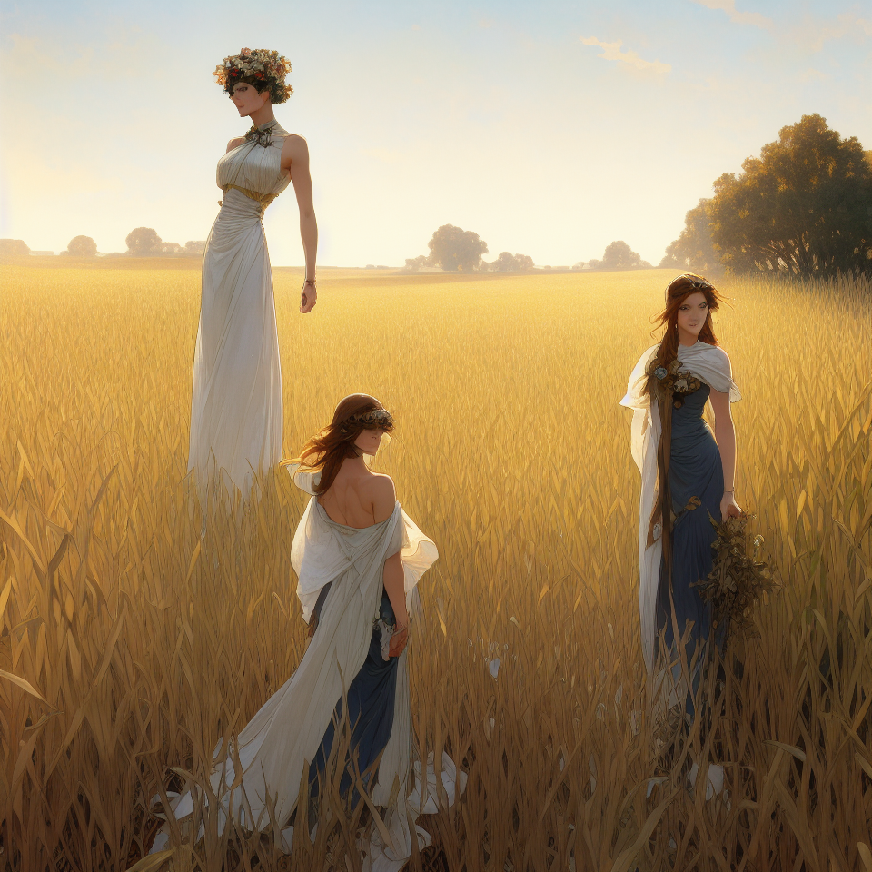 | 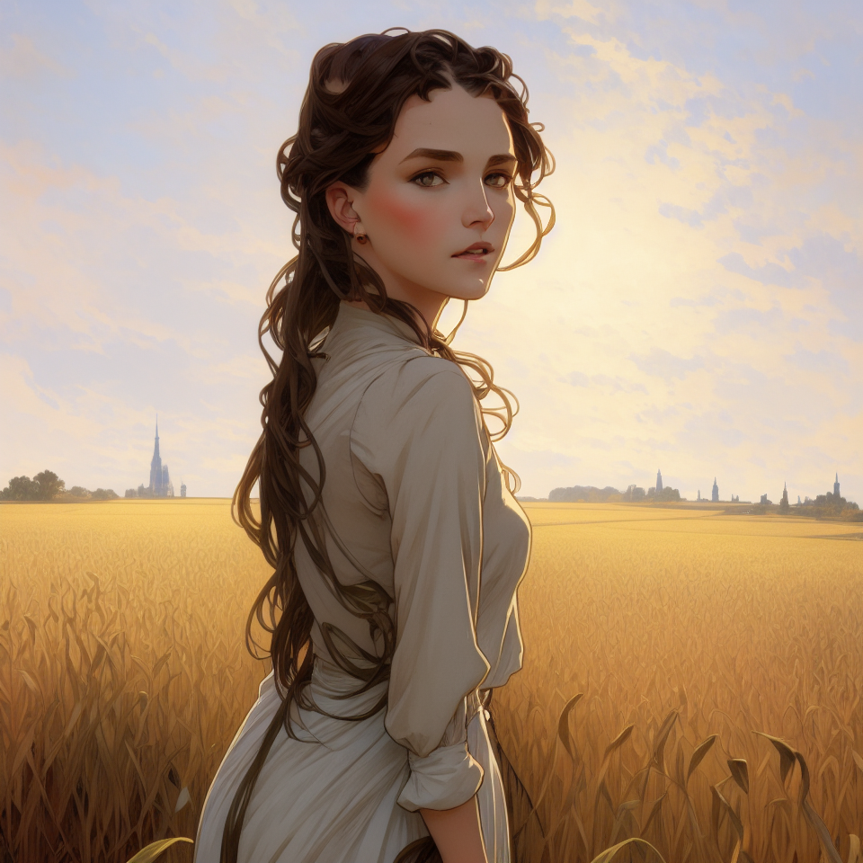 |

Small picture is rendered at whatever resolution you set using width/height sliders.
Large picture's dimensions are controlled by three sliders: "Scale by" multiplier (Hires upscale), "Resize width to" and/or "Resize height to" (Hires resize).

* If "Resize width to" and "Resize height to" are 0, "Scale by" is used.
* If "Resize width to" is 0, "Resize height to" is calculated from width and height.
* If "Resize height to" is 0, "Resize width to" is calculated from width and height.
* If both "Resize width to" and "Resize height to" are non-zero, image is upscaled to be at least those dimensions, and some parts are cropped.

##### Upscalers

A dropdown allows you to to select the kind of upscaler to use for resizing the image. In addition to all upscalers you have available on extras tab, there is an option to upscale a latent space image, which is what stable diffusion works with internally - for a 3x512x512 RGB image, its latent space representation would be 4x64x64. To see what each latent space upscaler does, you can set Denoising strength to 0 and Hires steps to 1 - you'll get a very good approximation of that stable diffusion would be working with on upscaled image.

Below are examples of how different latent upscale modes look. 

| Original                     |
|------------------------------|
| 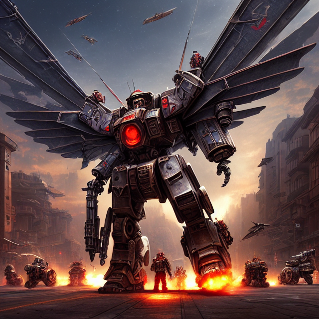 | 

| Latent, Latent (antialiased)                     | Latent (bicubic), Latent (bicubic, antialiased) | Latent (nearest)            |
|------------------------------|------------------------------|------------------------------|
|  | 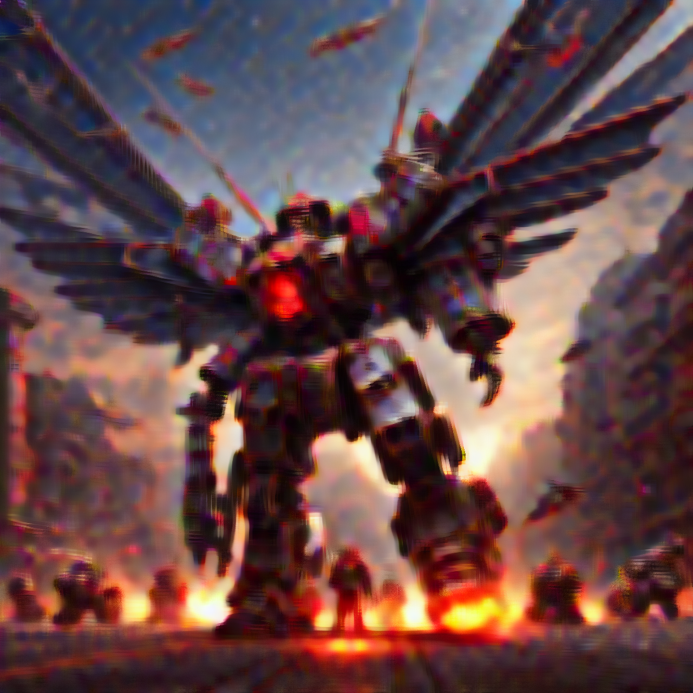 | 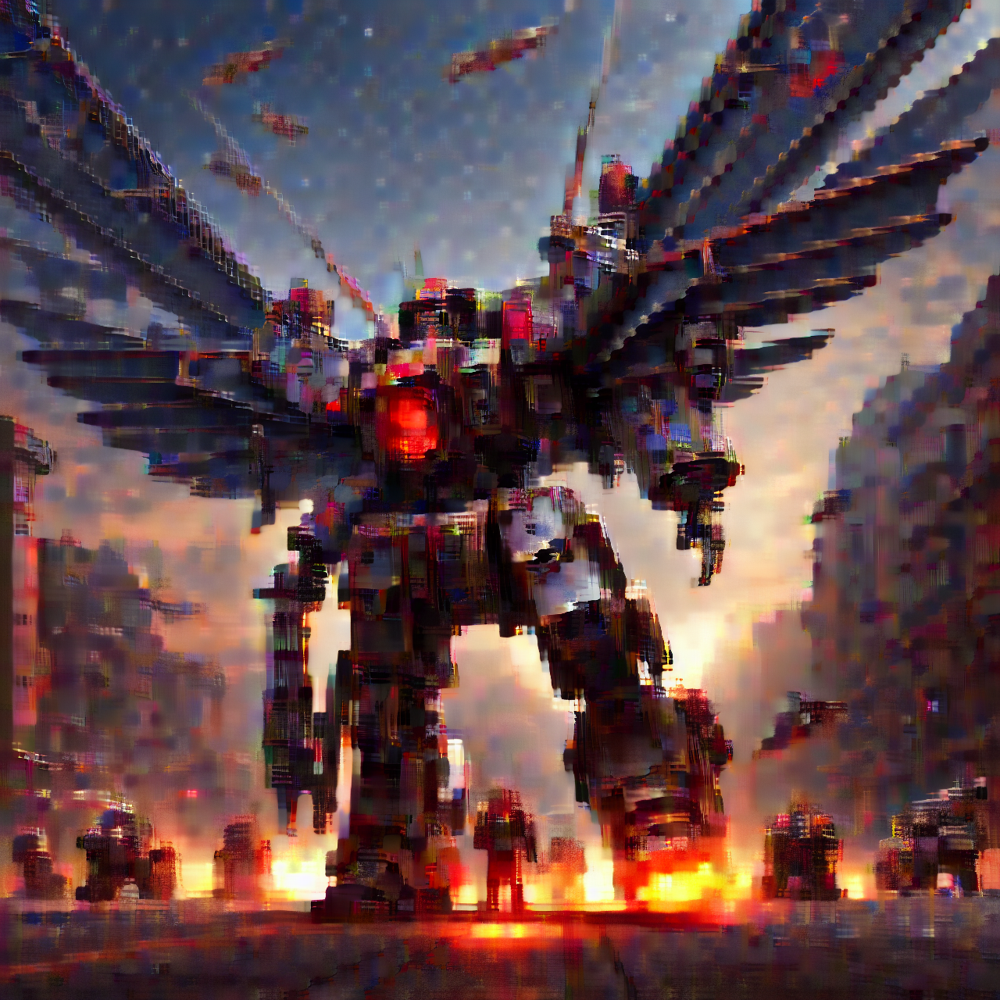 |

Antialiased variations were PRd in by a contributor and seem to be the same as non-antialiased.

#### Composable Diffusion

A method to allow the combination of multiple prompts.
combine prompts using an uppercase AND

    a cat AND a dog

Supports weights for prompts: `a cat :1.2 AND a dog AND a penguin :2.2`
The default weight value is 1.
It can be quite useful for combining multiple embeddings to your result: `creature_embedding in the woods:0.7 AND arcane_embedding:0.5 AND glitch_embedding:0.2` 

Using a value lower than 0.1 will barely have an effect. `a cat AND a dog:0.03` will produce basically the same output as `a cat`

This could be handy for generating fine-tuned recursive variations, by continuing to append more prompts to your total. `creature_embedding on log AND frog:0.13 AND yellow eyes:0.08`

#### Interrupt

Press the Interrupt button to stop current processing.

#### 4GB videocard support

Optimizations for GPUs with low VRAM. This should make it possible to generate 512x512 images on videocards with 4GB memory.

`--lowvram` is a reimplementation of an optimization idea by [basujindal](https://github.com/basujindal/stable-diffusion).
Model is separated into modules, and only one module is kept in GPU memory; when another module needs to run, the previous
is removed from GPU memory. The nature of this optimization makes the processing run slower -- about 10 times slower
compared to normal operation on my RTX 3090.

`--medvram` is another optimization that should reduce VRAM usage significantly by not processing conditional and
unconditional denoising in the same batch.

This implementation of optimization does not require any modification to the original Stable Diffusion code.

#### Face restoration

Lets you improve faces in pictures using either GFPGAN or CodeFormer. There is a checkbox in every tab to use face restoration,
and also a separate tab that just allows you to use face restoration on any picture, with a slider that controls how visible
the effect is. You can choose between the two methods in settings.

| Original                | GFPGAN                         | CodeFormer                         |
|-------------------------|--------------------------------|------------------------------------|
| 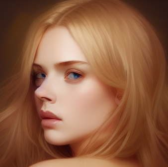 | 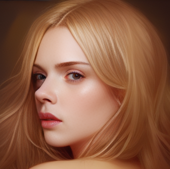 |  |

#### Saving

Click the Save button under the output section, and generated images will be saved to a directory specified in settings;
generation parameters will be appended to a csv file in the same directory.

#### Loading

Gradio's loading graphic has a very negative effect on the processing speed of the neural network.
My RTX 3090 makes images about 10% faster when the tab with gradio is not active. By default, the UI
now hides loading progress animation and replaces it with static "Loading..." text, which achieves
the same effect. Use the `--no-progressbar-hiding` commandline option to revert this and show loading animations.

#### Prompt validation

Stable Diffusion has a limit for input text length. If your prompt is too long, you will get a
warning in the text output field, showing which parts of your text were truncated and ignored by the model.

#### Png info

Adds information about generation parameters to PNG as a text chunk. You
can view this information later using any software that supports viewing
PNG chunk info, for example: https://www.nayuki.io/page/png-file-chunk-inspector

#### Settings

A tab with settings, allows you to use UI to edit more than half of parameters that previously
were commandline. Settings are saved to config.js file. Settings that remain as commandline
options are ones that are required at startup.

#### Filenames format

The `Images filename pattern` field in the Settings tab allows customization of generated txt2img and img2img images filenames. This pattern defines the generation parameters you want to include in filenames and their order. The supported tags are:

`[steps], [cfg], [prompt], [prompt_no_styles], [prompt_spaces], [width], [height], [styles], [sampler], [seed], [model_hash], [prompt_words], [date], [datetime], [job_timestamp].`

This list will evolve though, with new additions. You can get an up-to-date list of supported tags by hovering your mouse over the "Images filename pattern" label in the UI.

Example of a pattern: `[seed]-[steps]-[cfg]-[sampler]-[prompt_spaces]`

Note about "prompt" tags: `[prompt]` will add underscores between the prompt words, while `[prompt_spaces]` will keep the prompt intact (easier to copy/paste into the UI again). `[prompt_words]` is a simplified and cleaned-up version of your prompt, already used to generate subdirectories names, with only the words of your prompt (no punctuation).

If you leave this field empty, the default pattern will be applied (`[seed]-[prompt_spaces]`).

Please note that the tags are actually replaced inside the pattern. It means that you can also add non-tags words to this pattern, to make filenames even more explicit. For example: `s=[seed],p=[prompt_spaces]`

#### User scripts

If the program is launched with `--allow-code` option, an extra text input field for script code
is available at the bottom of the page, under Scripts -> Custom code. It allows you to input python
code that will do the work with the image.

In code, access parameters from web UI using the `p` variable, and provide outputs for web UI
using the `display(images, seed, info)` function. All globals from the script are also accessible.

A simple script that would just process the image and output it normally:

```python
import modules.processing

processed = modules.processing.process_images(p)

print("Seed was: " + str(processed.seed))

display(processed.images, processed.seed, processed.info)
```

#### UI config

You can change parameters for UI elements:
 - radio groups: default selection
 - sliders: default value, min, max, step
 - checkboxes: checked state
 - text and number inputs: default values

The file is ui-config.json in webui dir, and it is created automatically if you don't have one when the program starts.

Checkboxes that would usually expand a hidden section will not initially do so when set as UI config entries.

Some settings will break processing, like step not divisible by 64 for width and height, and some, like changing the default
function on the img2img tab, may break UI. I do not have plans to address those in near future.

#### ESRGAN

It's possible to use ESRGAN models on the Extras tab, as well as in SD upscale.

To use ESRGAN models, put them into ESRGAN directory in the same location as webui.py.
A file will be loaded as a model if it has .pth extension. Grab models from the [Model Database](https://upscale.wiki/wiki/Model_Database).

Not all models from the database are supported. All 2x models are most likely not supported.

#### img2img alternative test

Deconstructs an input image using a reverse of the Euler diffuser to create the noise pattern used to construct the input prompt.

As an example, you can use this image. Select the img2img alternative test from the *scripts* section.

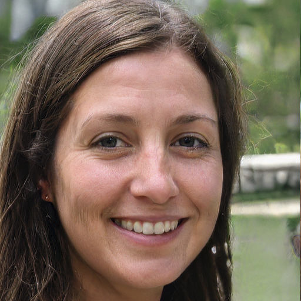

Adjust your settings for the reconstruction process:
- Use a brief description of the scene: "A smiling woman with brown hair." Describing features you want to change helps. Set this as your starting prompt, and 'Original Input Prompt' in the script settings.
- You *MUST* use the Euler sampling method, as this script is built on it.
- Sampling steps: 50-60. This MUCH match the decode steps value in the script, or you'll have a bad time. Use 50 for this demo.
- CFG scale: 2 or lower. For this demo, use 1.8. (Hint, you can edit ui-config.json to change "img2img/CFG Scale/step" to .1 instead of .5.
- Denoising strength - this *does* matter, contrary to what the old docs said. Set it to 1.
- Width/Height - Use the width/height of the input image.
- Seed...you can ignore this. The reverse Euler is generating the noise for the image now.
- Decode cfg scale - Somewhere lower than 1 is the sweet spot. For the demo, use 1.
- Decode steps - as mentioned above, this should match your sampling steps. 50 for the demo, consider increasing to 60 for more detailed images.

Once all of the above are dialed in, you should be able to hit "Generate" and get back a result that is a *very* close approximation to the original.

After validating that the script is re-generating the source photo with a good degree of accuracy, you can try to change the details of the prompt. Larger variations of the original will likely result in an image with an entirely different composition than the source.

Example outputs using the above settings and prompts below (Red hair/pony not pictured)

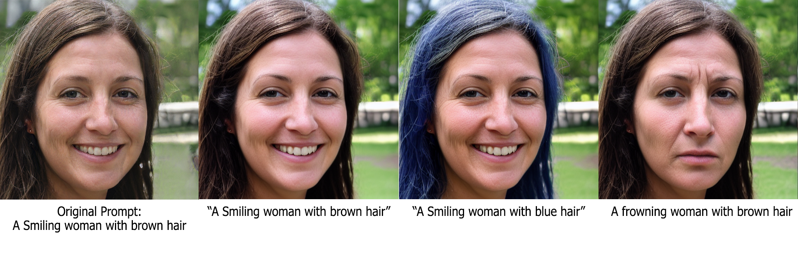

"A smiling woman with blue hair." Works.
"A frowning woman with brown hair." Works.
"A frowning woman with red hair." Works.
"A frowning woman with red hair riding a horse." Seems to replace the woman entirely, and now we have a ginger pony.

#### user.css

Create a file named `user.css` near `webui.py` and put custom CSS code into it. For example, this makes the gallery taller:

```css
#txt2img_gallery, #img2img_gallery{
    min-height: 768px;
}
```
A useful tip is you can append `/?__theme=dark` to your webui url to enable a built in *dark theme*
<br>e.g. (`http://127.0.0.1:7860/?__theme=dark`)

Alternatively, you can add the `--theme=dark` to the `set COMMANDLINE_ARGS=` in `webui-user.bat`<br>
e.g. `set COMMANDLINE_ARGS=--theme=dark`


#### notification.mp3

If an audio file named `notification.mp3` is present in webui's root folder, it will be played when the generation process completes.

As a source of inspiration:
* https://pixabay.com/sound-effects/search/ding/?duration=0-30
* https://pixabay.com/sound-effects/search/notification/?duration=0-30

#### Tweaks

##### Ignore last layers of CLIP model

This is a slider in settings, and it controls how early the processing of prompt by CLIP network should be stopped.

A more detailed explanation:

CLIP is a very advanced neural network that transforms your prompt text into a numerical representation. Neural networks work very well with this numerical representation and that's why devs of SD chose CLIP as one of 3 models involved in stable diffusion's method of producing images. As CLIP is a neural network, it means that it has a lot of layers. Your prompt is digitized in a simple way, and then fed through layers. You get numerical representation of the prompt after the 1st layer, you feed that into the second layer, you feed the result of that into third, etc, until you get to the last layer, and that's the output of CLIP that is used in stable diffusion. This is the slider value of 1. But you can stop early, and use the output of the next to last layer - that's slider value of 2. The earlier you stop, the less layers of neural network have worked on the prompt.

Some models were trained with this kind of tweak, so setting this value helps produce better results on those models.

## Models

For any of the below, make sure you add the correct keyword. For example for Disney, you need to add `modern disney`, so a query would be `modern disney brad pitt`. Using AUTOMATIC1111 you can change the active model in the top left of the web app.

Disney: https://huggingface.co/nitrosocke/mo-di-diffusion
Classic Disney: https://huggingface.co/nitrosocke/classic-anim-diffusion

## Images That Don't Suck

So you've taken the dive and [installed Stable Diffusion](https://github.com/hlky/stable-diffusion). But this isn't quite like Dalle2. There's sliders everywhere, different diffusers, seeds... Enough to make anyone's head spin. But don't fret. These settings will give you a better experience once you get comfortable with them. In this guide, I'm going to talk about how to generate text2image artwork using Stable Diffusion. **I'm going to go over basic prompting theory, what different settings do, and in what situations you might want to tweak the settings.**

_Disclaimer_: Ultimately we are ALL beginners at this, including me. If anything I say sounds totally different than your experience, please comment and show me with examples! Let's share information and learn together in the comments!

_Note_: if the thought of reading this long post is giving you a throbbing migraine, just use the following settings:

> **CFG (Classifier Free Guidance): 8**

> **Sampling Steps: 50**

> **Sampling Method: k_lms**

> **Random seed**

These settings are completely fine for a wide variety of prompts. That'll get you having fun at least. Save this post and come back to this guide when you feel ready for it.

### Prompting

Prompting could easily be its own post (let me know if you like this post and want me to work on that). But I can go over some good practices and broad brush stuff here.

**Sites that have repositories of AI imagery with included prompts and settings like** [**https://lexica.art/**](https://lexica.art/) **are your god.** Flip through here and look for things similar to what you want. Or just let yourself be inspired. Take note of phrases used in prompts that generate good images. Steal liberally. Remix. Steal their prompt verbatim and then take out an artist. What happens? Have fun with it. Ultimately, the process of creating images in Stable Diffusion is self-driven. I can't tell you what to do.

You can add as much as you want at once to your prompts. Don't feel the need to add phrases one at a time to see how the model reacts. The model likes shock and awe. Typically, the longer and more detailed your prompt is, the better your results will be. Take time to be specific. My theory for this is that people don't waste their time describing in detail images that they don't like. The AI is weirdly intuitively trained to see "Wow this person has a lot to say about this piece!" as "quality image". So be bold and descriptive. Just keep in mind every prompt has a token limit of (I believe) 75. Get yourself a GUI that tells you when you've hit this limit, or you might be banging your head against your desk: some GUIs will happily let you add as much as you want to your prompt while silently truncating the end. Yikes.

If your image looks straight up bad (or nowhere near what you're imagining) at _k_euler_a, step 15, CFG 8_ (I'll explain these settings in depth later), messing with other settings isn't going to help you very much. Go back to the drawing board on your prompt. At the early stages of prompt engineering, you're mainly looking toward mood, composition (how the subjects are laid out in the scene), and color. Your spit take, essentially. If it looks bad, add or remove words and phrases until it doesn't look bad anymore. Try to debug what is going wrong. Look at the image and try to see why the AI made the choices it did. There's always a reason in your prompt (although sometimes that reason can be utterly inscrutable).

Allow me a quick aside on using artist names in prompts: use them. They make a big difference. Studying artists' techniques also yields great prompt phrases. Find out what fans and art critics say about an artist. How do they describe their work?

---

Keep tokenizing in mind:

> scary swamp, dark, terrifying, greg rutkowski

This prompt is an example of one possible way to tokenize a prompt. See how I'm separating descriptions from moods and artists with commas? You _can_ do it this way, but you don't have to. _"moody greg rutkowski piece"_ instead of _"greg rutkowski"_ is cool and valid too. Or "_character concept art by greg rutkowski_". These types of variations can have a massive impact on your generations. Be creative.

Just keep in mind **order matters**. The things near the front of your prompt are weighted more heavily than the things in the back of your prompt. If I had the prompt above and decided I wanted to get a little more greg influence, I could reorder it:

> greg rutkowski, dark, scary swamp, terrifying

Essentially, each chunk of your prompt is a slider you can move around by physically moving it through the prompt. If your faces aren't detailed enough? Add something like _"highly-detailed symmetric faces"_ to the front. Your piece is a little _TOO_ dark? Move "_dark_" in your prompt to the very end. The AI also pays attention to emphasis! If you have something in your prompt that's important to you, be annoyingly repetitive. Like if I was imagining a spooky piece and thought the results of the above prompt weren't scary enough I might change it to:

> greg rutkowski, dark, surreal scary swamp, terrifying, horror, poorly lit

Imagine you were trying to get a glass sculpture of a unicorn. You might add "_glass, slightly transparent, made of glass_". The same repetitious idea goes for quality as well. This is why you see many prompts that go like:

> greg rutkowski, highly detailed, dark, surreal scary swamp, terrifying, horror, poorly lit, trending on artstation, incredible composition, masterpiece

Keeping in mind that putting "quality terms" near the front of your prompt makes the AI pay attention to quality FIRST since order matters. Be a fan of your prompt. When you're typing up your prompt, word it like you're excited. Use natural language that you'd use in real life OR pretentious bull crap. Both are valid. Depends on the type of image you're looking for. Really try to describe your mind's eye and don't leave out mood words.

_PS: In my experimentation, capitalization doesn't matter. Parenthesis and brackets don't matter. Exclamation points work only because the AI thinks you're really exited about that particular word. Generally, write prompts like a human. The AI is trained on how humans talk about art._

Ultimately, prompting is a skill. It takes practice, an artistic eye, and a poetic heart. You should speak to ideas, metaphor, emotion, and energy. Your ability to prompt is not something someone can steal from you. **So if you share an image, please share your prompt and settings.** Every prompt is a unique pen. But it's a pen that's infinitely remixable by a hypercreative AI and the collective intelligence of humanity. The more we work together in generating cool prompts and seeing what works well, the better we _ALL_ will be. That's why I'm writing this at all. I could sit in my basement hoarding my knowledge like a cackling goblin, but I want _everyone_ to do better.

### Classifier Free Guidance (CFG)

Probably the coolest singular term to play with in Stable Diffusion. **CFG measures how much the AI will listen to your prompt vs doing its own thing.** Practically speaking, it is a measure of how confident you feel in your prompt. Here's a CFG value gut check:

-   CFG 2 - 6: Let the AI take the wheel.
    
-   CFG 7 - 11: Let's collaborate, AI!
    
-   CFG 12 - 15: No, seriously, this is a good prompt. Just do what I say, AI.
    
-   CFG 16 - 20: DO WHAT I SAY OR ELSE, AI.
    

All of these are valid choices. It just depends on where you are in your process. I recommend most people mainly stick to the CFG 7-11 range unless you really feel like your prompt is great and the AI is ignoring important elements of it (although it might just not understand). If you'll let me get on my soap box a bit, I believe we are entering a stage of AI history where human-machine teaming is going to be where we get the best results, rather than an AI alone or a human alone. And the CFG 7-11 range represents this collaboration.

The more you feel your prompt sucks, the more you might want to try CFG 2-6. Be open to what the AI shows you. Sometimes you might go "Huh, that's an interesting idea, actually". Rework your prompt accordingly. The AI can run with even the shittiest prompt at this level. At the end of the day, the AI is a hypercreative entity who has ingested most human art on the internet. It knows a thing or two about art. So trust it.

Powerful prompts can survive at CFG 15-20. But like I said above, CFG 15-20 is you screaming at the AI. Sometimes the AI will throw a tantrum (few people like getting yelled at) and say "Shut up, your prompt sucks. I can't work with this!" past CFG 15. If your results look like crap at CFG 15 but you still think you have a pretty good prompt, you might want to try CFG 12 instead. CFG 12 is a softer, more collaborative version of the same idea.

One more thing about CFG. CFG will change how reactive the AI is to your prompts. Seems obvious, but sometimes if you're noodling around making changes to a complex prompt at CFG 7, you'd see more striking changes at CFG 12-15. Not a reason not to stay at CFG 7 if you like what you see, just something to keep in mind.

Sampling Method / Sampling Steps / Batch Count

These are closely tied, so I'm bundling them. Sampling steps and sampling method are kind of technical, so I won't go into what these are actually doing under the hood. I'll be mainly sticking to how they impact your generations. These are also frequently misunderstood, and our understanding of what is _"best"_ in this space is very much in flux. So take this section with a grain of salt. I'll just give you some good practices to get going. I'm also not going to talk about _every_ sampler. Just the ones I'm familiar with.

### k_lms: The Old Reliable

k_lms at 50 steps will give you fine generations most of the time if your prompt is good. k_lms runs pretty quick, so the results will come in at a good speed as well. You could easily just stick with this setting forever at CFG 7-8 and be ok. If things are coming out looking a little cursed, you could try a higher step value, like 80. But, as a rule of thumb, **make sure your higher step value is actually getting you a benefit, and you're not just wasting your time**. You can check this by holding your seed and other settings steady and varying your step count up and down. You might be shocked at what a low step count can do. I'm very skeptical of people who say their every generation is 150 steps.

### k_ddim: The Speed Demon

k_ddim at 8 steps (**yes, you read that right. 8 steps**) can get you great results at a blazing fast speed. This is a wonderful setting for generating a lot of images quickly. When I'm testing new prompt ideas, I'll set k_ddim to 8 steps and generate a batch of 4-9 images. This gives you a _fantastic_ birds eye view of how your prompt does across multiple seeds. This is a terrific setting for rapid prompt modification. You can add one word to your prompt at k_ddim:8 and see how it affects your output across seeds in less than 5 seconds (graphics card depending). For more complex prompts, k_ddim might need more help. Feel free to go up to 15, 25, or even 35 if your output is still coming out looking garbled (or is the prompt the issue??). You'll eventually develop an eye for when increasing step count will help. Same rule as above applies, though. Don't waste your own time. Every once in a while make sure you need all those steps.

### k_euler_a: The Chameleon

Everything that applies to k_ddim applies here as well. This sampler is also lightning fast and also gets great results at extremely low step counts (steps 8-16). But it also changes generation style a lot more. Your generation at step count 15 might look very different than step count 16. And then they might BOTH look very different than step count 30. And then THAT might be very different than step count 65. This sampler is wild. It's also worth noting here in general: **your results will look** _**TOTALLY**_ **different depending on what sampler you use**. So don't be afraid to experiment. If you have a result you already like a lot in k_euler_a, pop it into k_ddim (or vice versa).

### k_dpm_2_a: The Starving Artist

In my opinion, this sampler might be the best one, but it has serious tradeoffs. It is _VERY_ slow compared to the ones I went over above. However, for my money, k_dpm_2_a in the 30-80 step range is very very good. It's a bad sampler for experimentation, but if you already have a prompt you love dialed in, let it rip. Just be prepared to wait. And wait. If you're still at the stage where you're adding and removing terms from a prompt, though, you should stick to k_euler_a or k_ddim at a lower step count.

I'm currently working on a theory that certain samplers are better at certain types of artwork. Some better at portraits, landscapes, etc. I don't have any concrete ideas to share yet, but it can be worth modulating your sampler a bit according to what I laid down above if you feel you have a good prompt, but your results seem uncharacteristically bad.

_A note on large step sizes_: Many problems that can be solved with a higher step count can also be solved with better prompting. If your subject's eyes are coming out terribly, try adding stuff to your prompt talking about their "symmetric highly detailed eyes, fantastic eyes, intricate eyes", etc. This isn't a silver bullet, though. Eyes, faces, and hands are difficult, non-trivial things to prompt to. Don't be discouraged. Keep experimenting, and don't be afraid to _remove_ things from a prompt as well. Nothing is sacred. You might be shocked by what you can omit. For example, I see many people add "attractive" to amazing portrait prompts... But most people in the images the AI is drawing from _are already_ attractive. In my experience, most of the time "attractive" simply isn't needed. _(Attractiveness is extremely subjective, anyway. Try "unique nose" or something. That usually makes cool faces. Make cool models.)_

_A note on large batch sizes_: Some people like to make 500 generations and choose, like, the best 4. I think in this situation you're better off reworking your prompt more. Most solid prompts I've seen get really good results within 10 generations.

### Seed

Have we saved the best for last? Arguably. If you're looking for a _singular good image_ to share with your friends or reap karma on reddit, looking for a good seed is _very high priority_. A good seed can enforce stuff like composition and color across a wide variety of prompts, samplers, and CFGs. Use k_ddim:8-16 to go seed hunting with your prompt. However, if you're mainly looking for a _fun prompt that gets consistently good results_, seed is less important. In that situation, you want your prompt to be adaptive across seeds and overfitting it to one seed can sometimes lead to it looking worse on other seeds. Tradeoffs.

The actual seed integer number is not important. It more or less just initializes a random number generator that defines the diffusion's starting point. Maybe someday we'll have cool seed galleries, but that day isn't today.

Seeds are fantastic tools for A/B testing your prompts. Lock your seed (choose a random number, choose a seed you already like, whatever) and add a detail or artist to your prompt. Run it. How did the output change? Repeat. This can be super cool for adding and removing artists. As an exercise for the reader, try running _"Oasis by HR Giger"_ and then _"Oasis by beeple"_ on the same seed. See how it changes a lot but some elements remain similar? Cool. Now try _"Oasis by HR Giger and beeple"_. It combines the two, but the composition remains pretty stable. That's the power of seeds.

Or say you have a nice prompt that outputs a portrait shot of a _"brunette"_ woman. You run this a few times and find a generation that you like. Grab that particular generation's seed to hold it steady and change the prompt to a _"blonde"_ woman instead. The woman will be in an identical or very similar pose but now with blonde hair. You can probably see how insanely powerful and easy this is. _Note:_ a higher CFG (12-15) can sometimes help for this type of test so that the AI actually listens to your prompt changes.
