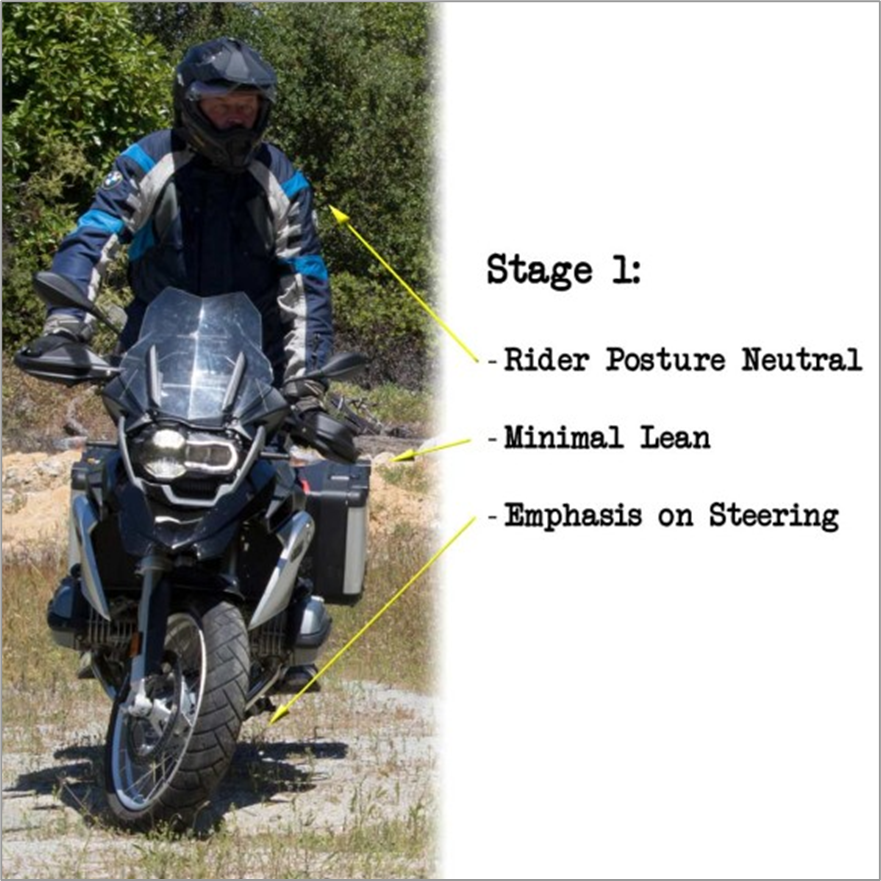
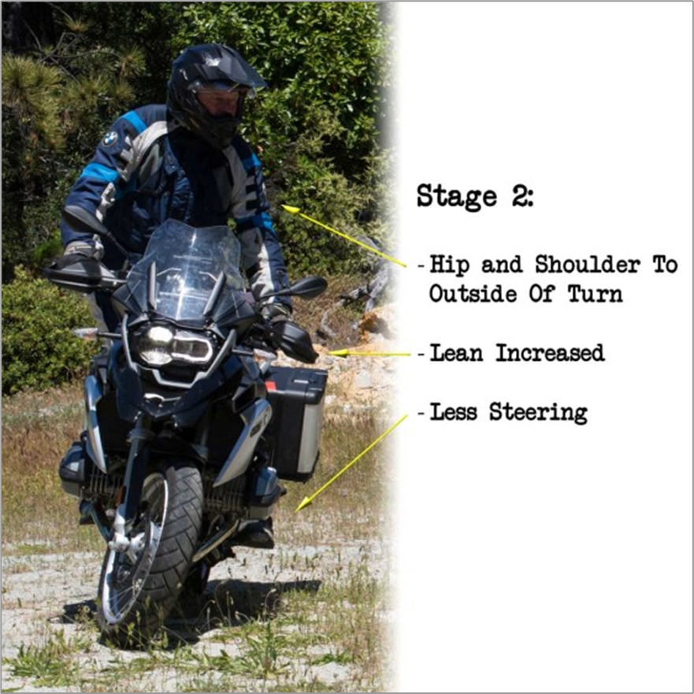
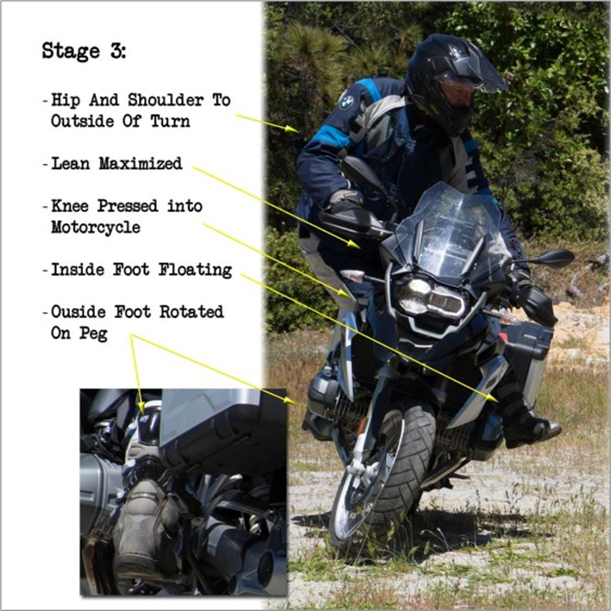

# Motorcycle

## Part Numbers

- 2x 32717658947 (weights)
- 1x 13537669776 (fuel filter)
- 15W-50 is BMW oil

## Proper Riding Techniques

### Turning

The rider will enter into a continuous turn, creating an unbroken circle, riding at approximately 5 mph. As each technique is employed, the rider will note that the radius of the circle tightens.

### Stage 1: The Novice Turn

 

This is a typical entry-level student turning technique. The bike is steered into a turning position, but the rider remains completely neutral; usually out of fear that any shift of weight will lead to slipping on whatever godforsaken Teflon they find themselves traversing. This technique limits the rider to a very large turning radius, which can be tightened a bit by feathering the clutch and throttle. Careful though: Too slow, and the bike cannot be leaned at all. Remember to grip the bike with your legs, so that your hands are left only to steer and actuate the controls. (Bar risers, aftermarket footpegs and Rotating the Handlebars can help to relax your grip).

### Stage 2: Shifting Weight

 

While continuing the circle, the rider shifts their hip and shoulder weight toward the outside of the turn, leaning away from the motorcycle. The inside foot becomes light on the peg, while the outside foot bares nearly all the weight of the rider. This offers 2 benefits:
1. The riders body mass acts as a counterweight against that of the bike. This partially ’neutralizes’ the collective weight of rider and machine, giving the motorcycle a lighter, more manageable feel.
2. The shift in weight helps apply traction, as it places essential mass directly above the grip patch of the tire.
This is one of the most counter-intuitive elements of Adventure Riding, since for most people the idea of ‘leaning out’ of a turn is completely foreign. We simply don’t employ this technique anywhere else, at least not that we’re aware of. But when done properly the machine will become more stable, and the turn radius will tighten.

### Stage 3: The Toe Turn

 

Now the rider rotates their outside foot, lifting it from the peg and reapplying at a 45 degree (ish) angle. This allows the rider to press a knee into the tank and rotate their body mass even further from the machine. The additional counter-weighting allows the bike to be leaned more heavily into the turn, tightening the steering and narrowing the radius even further. The legs are ‘squeezed together’ in order to hold on to the bike, and lessen the grip on the handlebars.
Bonus: Lift your inside Leg. Once the rider becomes comfortable turning their toes and leaning away from the machine, the inside foot will become completely unhindered by rider weight. In this instance, the foot can be completely removed from the inside peg. The rider then hooks the inside of their leg against the seat edge, squeezing for grip and leaning further still from the machine. Fair Warning: This technique requires a leap of faith, as the motorcycle has the potential to lean further than most have ever dared go (without falling over, that is), and the turning radius so tight that the handlebars will begin to bump off their steering limit. This should only be employed after the rider is comfortable with the other turning drills.
Once these techniques are mastered, riders will find use for all stages in a real world setting. Stage 1 works best for mild turns on high-traction off-road riding. Stages 2 and 3 become essential when the turns become tight or technical, or both! Just remember; like all things, turning technique is a perishable skill, especially when in the learning process. So keep at it and don’t get discouraged, even the most accomplished riders have to start somewhere!
Turning off-road is something that should be learned at the slowest pace possible. Only then can you understand how tight you can turn your bike when using the right technique. The hardest thing for me to learn was not leaning into the corner, when either standing or sitting.

As road riders, we want to lean our bodies into the corner to keep the bike more upright, which increases tire contact/traction. In the dirt, the tire design works better by leaning the bike into corners, while you remain standing or sitting upright. This allows the knobby or big tread tires to dig into the dirt and provide more traction.

Start learning with slow turns. Remember to always weight the outside peg, and keep your shoulders square to the bars.  Began left-hand circles at a slow pace. While standing, keep your body upright, and shoulders square to the bars.

Keep your shoulders square, even if you have your bars locked in the tightest turning position. Do this by turning your upper body in the direction you are going. Some people only twist their upper bodies. Others, including me, like to move the entire body, including the feet slightly, or whatever is allowed due to space constraints, in that direction.

Continuing with this left turn, keep all your weight on your right leg. While practicing, I’ll also take my left foot completely off the peg, making sure all the weight is on the outside. Keep practicing and eventually you’ll be able to lock the bars and complete the tightest turns your bike possibly allows. Oh, and when learning, plan on dropping your bike a few times; don’t worry, this is normal.

Practice slow turning in both directions for the rest of your riding career—especially at the beginning of a season. The slower the better; you’ll improve your balance over time.

As for fast corners, get all braking completed before turning the bike; trail braking (keeping pressure on at start of turn) is great on the street, but will wipe you out in the dirt. Keep the weight a bit forward for added front-tire traction, and initiate turn-in with the bike, not the body (stay upright!).

Based on speed, this is where things can get fun. Initiate turn, point, and get on the throttle to slide the rear tire and finish the turn. Another advanced technique is locking the rear tire to help the bike initiate the turn with a slide—extreme fun.

Stop with Front; Steer with Rear Brake 

There’s still much confusion out there concerning braking off-road. I discussed this with Baja 1000 winner and Dakar podium finisher Jimmy Lewis at the Touratech Rally East this past August. You still need the front brake to stop.

The front brake is for stopping, and the rear is for steering. Rely on the front brakes for slowing/stopping, and use the rear to steer the bike, such as skidding the rear to point the bike into whatever direction is needed.

Even in the dirt, think of the braking bias as 80 percent front/20 percent rear. Learn the threshold of locking up the front tire, and you’ll be able to brake harder than you’ve ever imagined.
