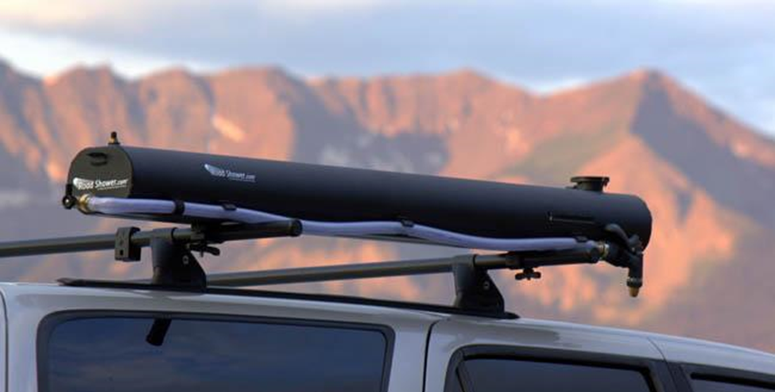

# Tacoma

## GFC

### Foam Density

- For any one that wants the exact specs of the stock foam it's a 2# polyurethane 35 ILD. If you want softer get a lower ILD but don't go too low or you'll just bottom out. Higher if you want more firm.
- 50" x 90" sleeping platform
- If opening is 13", panel is 50"x12"
- 50"x90" mattress (76"), actual 48" wide pad
- Another source says 2.8 lb density.

### Dimensions

- Sleeping platform: 50” x 90” interior for Mid Size Trucks, 53” x 93” exterior (excluding corner brackets)
- 56” x 90” for Full Size Trucks.
- 1” of space between mattress & roof panel when closed, 6” thick closed (exterior)
- Interior height (from truck bed floor): 96”
- Canopy/cargo space (from truck bed floor): 41”
- Weight: 275-300 lbs (depending on vehicle)

### Construction

- DOM tube space frame, in [orange or forge gray powder coat](https://www.tacomaworld.com/posts/17083675)
- [0.080” 5052 aluminum](https://www.tacomaworld.com/posts/17023061) sheet doors, [construction details](https://www.tacomaworld.com/posts/17110831)
- [Attachment method](https://www.tacomaworld.com/posts/17068529) to truck bed
- [Panel attachment](https://www.tacomaworld.com/posts/16468133) to space-frame

## Electronics

### Headunit

- Ideal resolution for screen is 1280 x 679
- 28 pin harness: [https://www.tacomaworld.com/threads/28-pin-head-unit-wiring-harness-adapter-and-oem-style-camera-gps-switches.458293/](https://www.tacomaworld.com/threads/28-pin-head-unit-wiring-harness-adapter-and-oem-style-camera-gps-switches.458293/)
- If ebrake light comes on, cut pin 15: [https://www.tacomaworld.com/threads/3rd-gen-tacoma-front-rear-camera-navigation-bypass-homelink-smartphone-mirroring-mod.473033/page-6#post-15365053](https://www.tacomaworld.com/threads/3rd-gen-tacoma-front-rear-camera-navigation-bypass-homelink-smartphone-mirroring-mod.473033/page-6#post-15365053)
- If no video going at speed, might need to add switch to pin 17: [https://www.tacomaworld.com/threads/3rd-gen-tacoma-front-rear-camera-navigation-bypass-homelink-smartphone-mirroring-mod.473033/page-5#post-15223124](https://www.tacomaworld.com/threads/3rd-gen-tacoma-front-rear-camera-navigation-bypass-homelink-smartphone-mirroring-mod.473033/page-5#post-15223124)

### Standards

- GPT wire (SAE J1128-GPT) - General Purpose Wire rated -40F to 176F (Generic wire found in most auto parts stores)
- GXL (SAE J1128-GXL) - Thin insulation, Automotive Cross-link Wire rated -49F to 257F
- TXL (SAE J1128-TXL) - Extra thin insulation, Automotive Cross-link Wire rated -49F to 257F

## Parts

### Wipers

85212-0E050 - Blade, Wiper RH
85222-04040 - Blade, Wiper LH
85214-0E140 - Insert
85214-04030 - Insert

### Seat Covers

Covercraft, but maybe get [these](https://coverking.com/products/2017-toyota-tacoma-seat-cover?variant=41410841182370&sub=SR5&main=seat-cover-ballistic-tactical) next time.

### Road Shower

- Dimensions: 56.5" x 7" x 5".
- Slot Channel is 55" long and the mounting bolts can be moved over this entire length.
- Holds 5 gallons of water.
- Empty Weight: 15 lbs. Full weight: 55 lbs.
- Boxed weight: 19 lbs. Box size: 9" x 9" x 58".
- Powder Coated Aluminum 1/10" thick walls.
- Pressure relief valves opens at 22 PSI.
- Hose length is 55".
- Mounting carriage bolts take a 1/2" nut. Nylock nuts included. 1/2" wrench needed.
- Elbow is 1/2"NPT thread x Male US GHT (Garden Hose Thread).
- Female hose end is GHT thread. Male hose end is GHT.
- Hose is 5/8" ID food grade hose such as used in the brewing industry.
- Intake air valve is Shrader valve. Road Shower 2 uses a 1/4" NPT thread. It is very tough.

## Repair

All from a 2nd gen forum, but probably close for 3rd: https://www.tacomaworld.com/threads/complete-list-of-tools-sockets-and-wrenches-for-2nd-gen-tacoma.158302/

### Metric sockets

- 5.5 mm, blower motor resistor screws.
- 8 mm, Running boards if you have them.
- 10 mm, Center console bolts, Stereo, engine cover, tail lights, interior
- 11 mm, Battery terminal
- 12 mm, Skid plate bolts, e-brake mounting bracket
- 13 mm, Tube steps if you have them.
- 14 mm, Transmission drain plug, Oil drain plug and Drive shaft bolts, exhaust system, center support bearing, Radiator bolts, and many, many more!
- 16 mm, Deep socket for spark plugs (16mm is virtually same as 5/8"; If you carry a 5/8 dedicated spark plug socket you don't need the 16mm)
- 17 mm, Power steering, Sway Bar, Cab mount nuts, leaf spring bolts, nuts.
- 19 mm, Lower Control Arm bolts and nuts., Deep socket for PCV valve
- 21 mm, Wheel Lug nuts
- 22 mm, Crank pulley bolt, Alternator
- 24 mm, Transfer case & Rear diff, drain and fill plugs
- 27 mm, shallow socket for reverse switch on manual transmissions
- 30 mm, Rear diff flange
- 35 mm, front Axle nut

### SAE sockets

- 7/32 socket for Blower Motor Resistor screws, 5.5mm works too.

### Metric Hex Sockets (Same as Allen Keys)

- 5 mm, Seat, transmission overflow plug
- 6 mm, Suspension, Front Axle
- 8 mm, 1GR-FE ENGINE CONTROL SYSTEM
- 10 mm, Front Diff fill and drain plug, 1GR-FE ENGINE CONTROL SYSTEM
- 12 mm, Front Diff Removal

### Torx Sockets

- T20, Audio / Visual
- T25, mirrors
- T30, Steering Column, SRS, Wiper and Wahser, Seat, tailgate bolts
- T40, Bed D-Rings
- T55, Bed bolts

### External / Interior / Female Torx Sockets

- E7 Torx socket to remove the 2 studs from the intake manifold
- E14 Torx (diff removal)

### Other

- Drive shaft bolts are M11 x 1.0 x 30mm
- Toyota uses 7/16-20 SAE fine thread for seat belt bolt hardware if your shopping for replacements.
- 10 mm flare nut wrench (brake lines)
- (2) M8 x 1.25 bolts (Needed to remove the rear brake drums, need to be at least an inch and a half long) YOU CAN USE THE BOLTS THAT HOLD THE FACTORY SKID PLATE ON TO DO THIS. THEY WORK GREAT.
- Bi-hexagon Wrench 10 mm, 1GR-FE ENGINE CONTROL SYSTEM
- Straight Hexagon Wrench 14 mm, 1GR-FE ENGINE MECHANICAL
- Oil Filter wrench
- 5/8" Spark Plug Socket or 16mm deep socket will also work for spark plugs.
- Torque wrench
- Breaker Bar
- Large and Small pair of adjustable pliers
- Long Needle nose pliers
- Knife or box cutter
- Long 8" screw driver
- Assorted ratchet extensions 3", 6" and 8"
- Phillips screw drivers, flex extension
- Grease gun (if 4x4) for zerks on drive shaft
